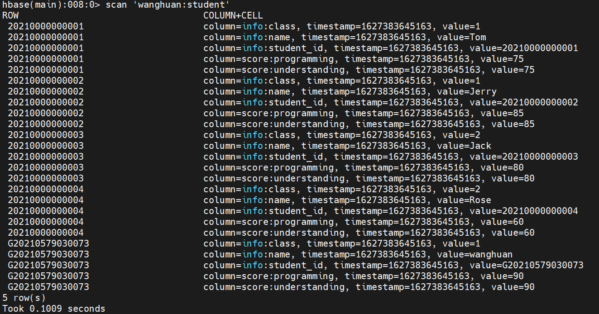

Hbase作业

目录： 

[toc]

## 集群环境

```markdown
CentOS Linux release 8.3.2011
Hadoop 3.1.3
Zookeeper 3.4.6
Hbase 2.1.0
java version "1.8.0_291"
```

## POM文件

```markdown
<?xml version="1.0" encoding="UTF-8"?>
<project xmlns="http://maven.apache.org/POM/4.0.0"
         xmlns:xsi="http://www.w3.org/2001/XMLSchema-instance"
         xsi:schemaLocation="http://maven.apache.org/POM/4.0.0 http://maven.apache.org/xsd/maven-4.0.0.xsd">
    <modelVersion>4.0.0</modelVersion>

    <groupId>org.example</groupId>
    <artifactId>HbaseAPI</artifactId>
    <version>1.0-SNAPSHOT</version>

    <properties>
        <maven.compiler.source>8</maven.compiler.source>
        <maven.compiler.target>8</maven.compiler.target>
        <hadoop.version>3.0.0</hadoop.version>
        <hbase.version>2.1.0</hbase.version>
        <junit.version>4.13</junit.version>
        <lombok.version>1.18.10</lombok.version>
    </properties>
    <dependencies>
        <dependency>
            <groupId>org.apache.hbase</groupId>
            <artifactId>hbase-client</artifactId>
            <version>${hbase.version}</version>
        </dependency>
        <dependency>
            <groupId>org.projectlombok</groupId>
            <artifactId>lombok</artifactId>
            <version>${lombok.version}</version>
        </dependency>
        <dependency>
            <groupId>junit</groupId>
            <artifactId>junit</artifactId>
            <version>${junit.version}</version>
        </dependency>
    </dependencies>
</project>
```

## 表结构设计


针对给出的表结构设计， 改造成了下列结构

| 表空间   | 表名    | rowkey     | 列族info              | 列族score                 |
| -------- | ------- | ---------- | --------------------- | ------------------------- |
| wanghuan | student | student_id | name,student_id,class | understanding,programming |

## 测试数据文件

src/main/resources/infodata.txt

```shell
Tom 20210000000001 1 75 82
Jerry 20210000000002 1 85 67
Jack 20210000000003 2 80 80
Rose 20210000000004 2 60 61
wanghuan G20210579030073 1 90 90
```

## 创建表


## 插入数据



## 查询数据

### 指定RowKey 点查一行数据


### 指定RowKey、列族、列名 查询单cell 内容


### 批量rowkey 查询

```shelll
查询条件：rowkey为 "20210000000002"，"20210000000001"
```


### 全表遍历


## 更新数据

### 根据RowKey update 某一列的值

```
删除条件： 
String rowKey = "G20210579030073" ;
String coloumnFamily = "info" ;
hbaseApiOperation.updateCellDataByRowKey(HbaseApiOperation.tableName,rowKey,coloumnFamily,"understanding",String.valueOf(100)) ;
```


## 删除数据

### 根据rowkey删除一行数据

```shell
删除条件： String rowKey = "20210000000004" ;
```


### 删除某一行 某一列簇的数据

```shell
删除条件：
String rowKey = "20210000000003" ;
String coloumnFamily = "score" ;
```


### 删除某一行某个列簇某几列的值

```shell
删除条件：
String rowKey = "20210000000002" ;
String coloumnFamily = "info" ;
"name"，"class" 两个列族 
```


### 删除表


## Hbase集群安装遇到问题

### 问题1 /opt/software/hadoop-3.1.3/libexec/hadoop-functions.sh:行2395: HADOOP_ORG.APACHE.HADOOP.HBASE.UTIL.GETJAVAPROPERTY_USER:错误的替换

hbase-env.sh文件尾添加如下配置  ， 重启之后 jps可以查到Hmaster

参考文档：https://blog.csdn.net/weixin_45048331/article/details/109823555

```shell
export HBASE_DISABLE_HADOOP_CLASSPATH_LOOKUP=true
```

### 问题 2 Failed get of master address: java.io.IOException: Can't get master address from ZooKeeper; znode data == null

端口号填写错误， 配置成HDFS RPC端口号

```xml
<property> 
        <name>hbase.rootdir</name>
        <value>hdfs://node1:8020/hbase</value>
</property>
```

### 问题 3 hbase shell命令使用正常，wei ui 无法打开60010页面

在hbase-site.xml中添加端口信息

```xml
<property>
    <name>hbase.master.info.port</name>
    <value>60010</value>
</property>
```

