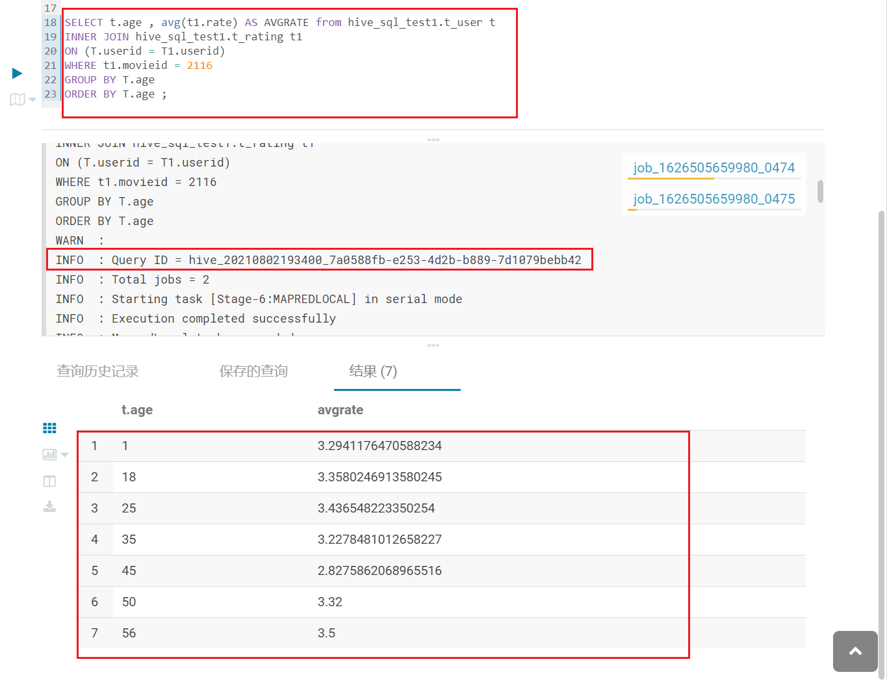
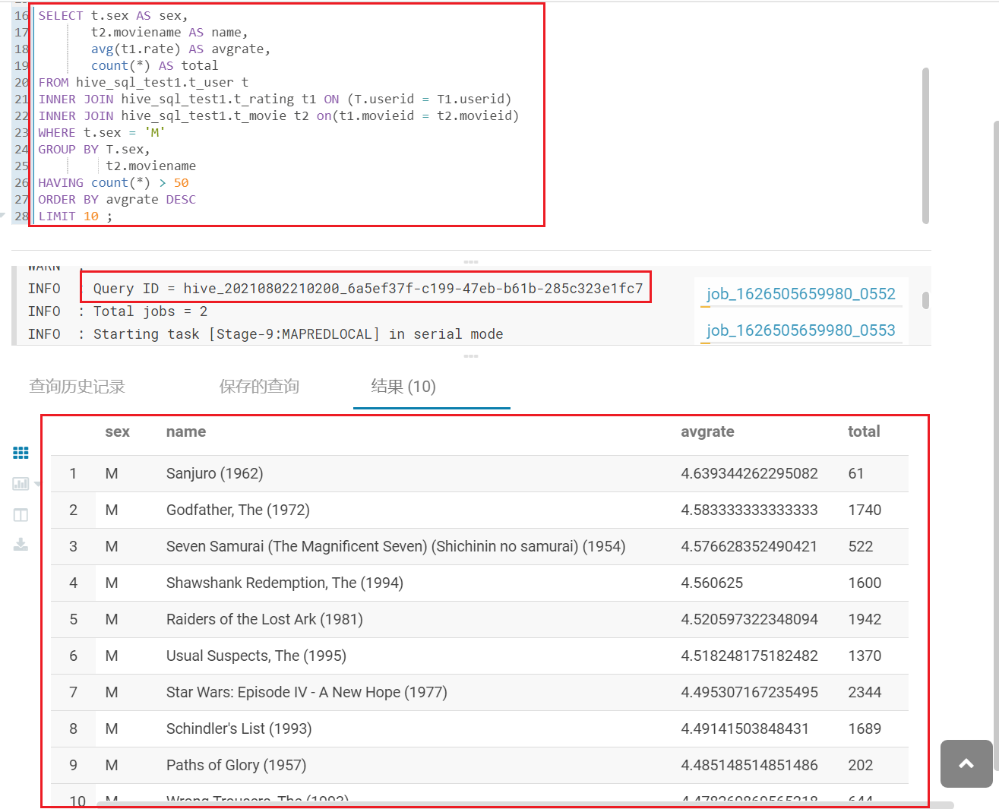
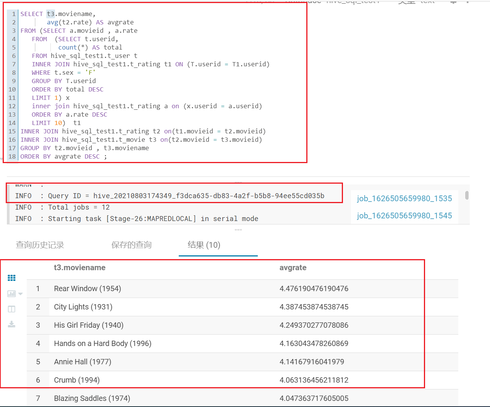
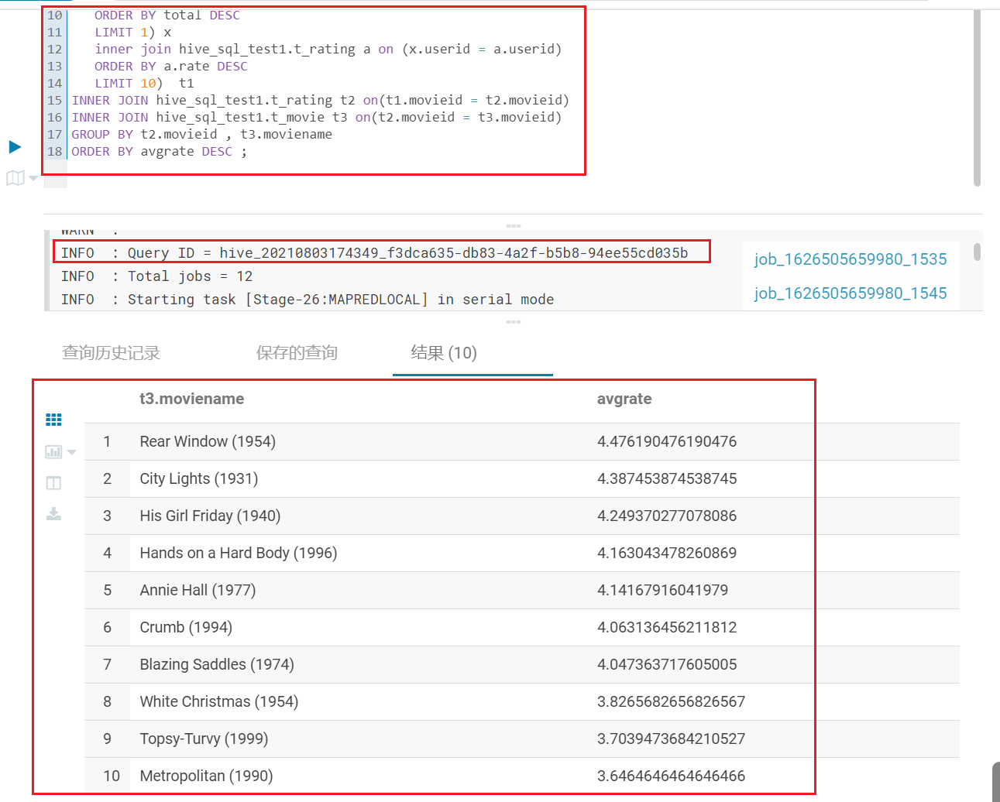
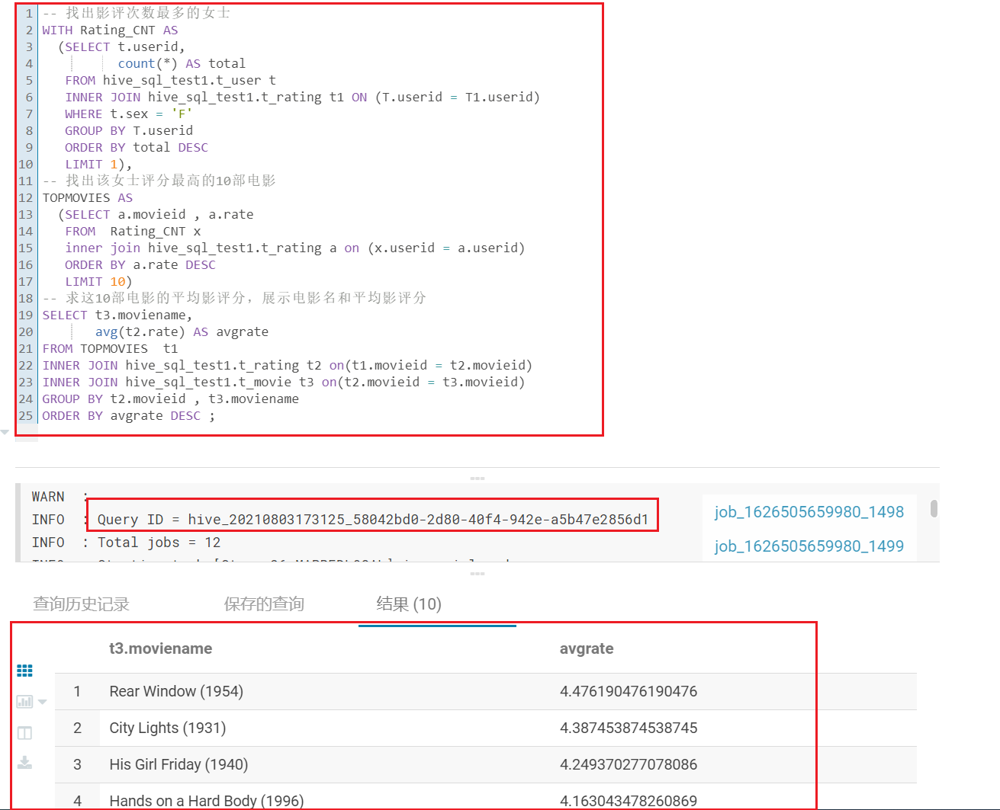
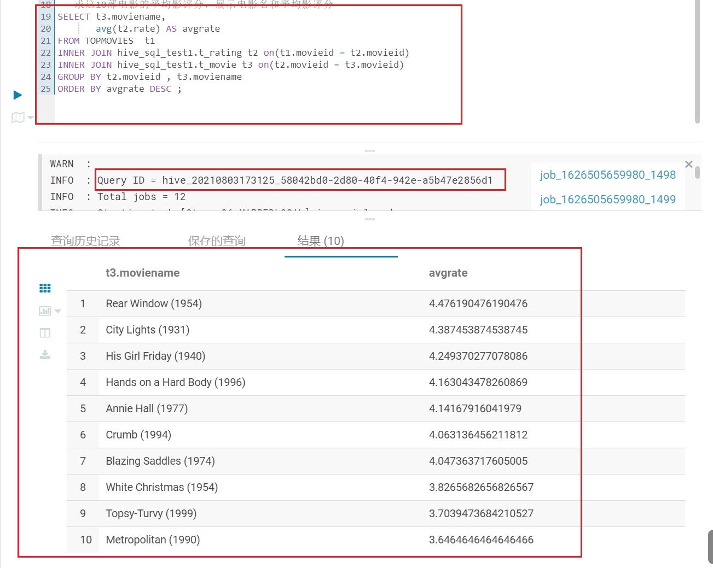
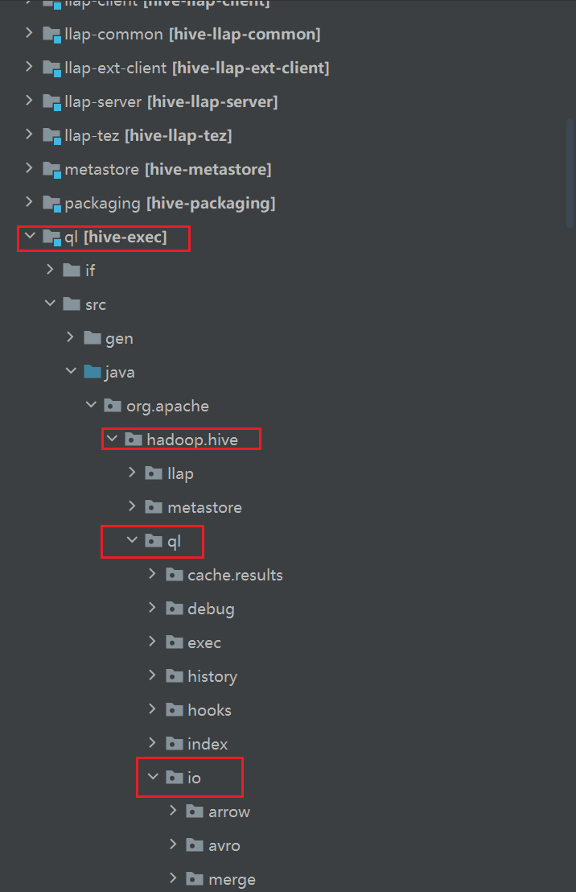
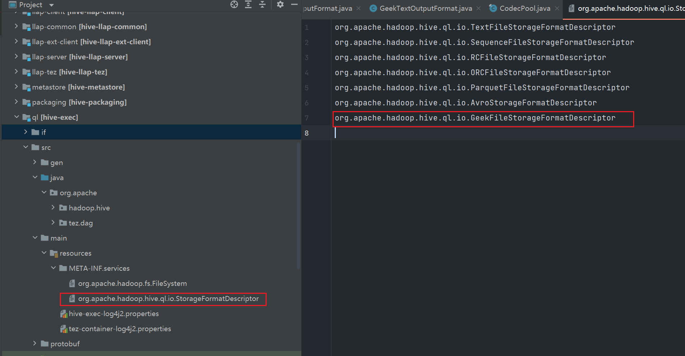
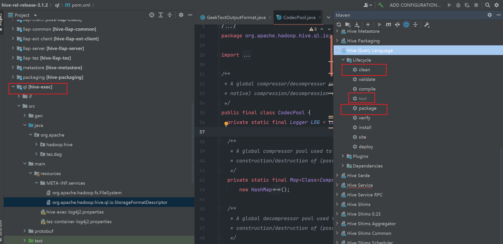

如果图片不显示， 请 git clone到本地进行查看

git clone git@github.com:wanghuan2054/geektime.git

Hive作业

目录： 

[toc]

## Hive 建表

```sql
create table hive_sql_test1.t_user(
userid bigint,
sex String,
age int,
occupation String,
zipcode String
)
row format delimited fields terminated by ':';
load data local inpath '/home/hive/users.dat'  overwrite into  table  hive_sql_test1.t_user;


create table hive_sql_test1.t_movie
(
movieid bigint,
moviename string,
movietype string
)
row format delimited fields terminated by ':';

load data local inpath '/home/hive/movies.dat' overwrite into table hive_sql_test1.t_movie;


create table hive_sql_test1.t_rating
(
userid bigint,
movieid bigint,
rate double,
times  string
)
row format delimited fields terminated by ':';
load data local inpath '/home/hive/ratings.dat' overwrite into table hive_sql_test1.t_rating;
```


## 题目1 

简单：展示电影ID为2116这部电影各年龄段的平均影评分

### 解法1 （不考虑数据倾斜）

不考虑数据倾斜问题

#### SQL

```sql
SELECT t.age , avg(t1.rate) AS AVGRATE from hive_sql_test1.t_user t 
INNER JOIN hive_sql_test1.t_rating t1 
ON (T.userid = T1.userid)
WHERE t1.movieid = 2116 
GROUP BY T.age
ORDER BY T.age ; 
```

#### 运行结果



### 解法2（考虑数据倾斜）

考虑数据倾斜问题，假设2116这部电影评分记录集中在28-30这个年龄段,其它年龄段寥寥无几

解决数据倾斜的方法很多，本文列出我的一条思路

1. 首先按照age和occupation 或者 age 和zipcode 进行分组 ， 对原先按照age分组所有age相同的数据会同时shuffle到一个reduce节点，按照新分组会将之前倾斜值的倾斜程度变为原来的1/N ， N=（occupation  或者zipcode 值）%reducer 的值的不同个数

2. 将1的子查询结果（GROUP BY T.age ,t.zipcode  预聚合 ），之后再统一对age进行分组求avg ， 降低了之前一个节点处理所有数据量。

   核心思路，分治思想，对任务进行拆分，先多字段分组求和， 后将中间聚合结果统一求avg。 

#### SQL

```sql
SELECT X.age as age , avg(X.sumrate) as avgrate FROM 
(
SELECT t.age , t.zipcode ,  sum(t1.rate) AS sumrate from hive_sql_test1.t_user t 
INNER JOIN hive_sql_test1.t_rating t1 
ON (T.userid = T1.userid)
WHERE t1.movieid = 2116 
GROUP BY T.age ,t.zipcode 
) X
GROUP BY X.age 
ORDER BY X.age ; 
```

## 题目2

中等：找出男性评分最高且评分次数超过50次的10部电影，展示电影名，平均影评分和评分次数

### SQL

```sql
SELECT t.sex AS sex,
       t2.moviename AS name,
       avg(t1.rate) AS avgrate,
       count(*) AS total
FROM hive_sql_test1.t_user t
INNER JOIN hive_sql_test1.t_rating t1 ON (T.userid = T1.userid)
INNER JOIN hive_sql_test1.t_movie t2 on(t1.movieid = t2.movieid)
WHERE t.sex = 'M'
GROUP BY T.sex,
         t2.moviename
HAVING count(*) > 50
ORDER BY avgrate DESC
LIMIT 10 ;
```

### 运行结果




## 题目3(选做)

困难：找出影评次数最多的女士所给出最高分的10部电影的平均影评分，展示电影名和平均影评分（可使用多行SQL）

### 写法1 

嵌套子查询

#### SQL

```sql
SELECT t3.moviename,
       avg(t2.rate) AS avgrate
FROM (SELECT a.movieid , a.rate
   FROM  (SELECT t.userid,
          count(*) AS total
   FROM hive_sql_test1.t_user t
   INNER JOIN hive_sql_test1.t_rating t1 ON (T.userid = T1.userid)
   WHERE t.sex = 'F'
   GROUP BY T.userid
   ORDER BY total DESC
   LIMIT 1) x
   inner join hive_sql_test1.t_rating a on (x.userid = a.userid)
   ORDER BY a.rate DESC
   LIMIT 10)  t1
INNER JOIN hive_sql_test1.t_rating t2 on(t1.movieid = t2.movieid)
INNER JOIN hive_sql_test1.t_movie t3 on(t2.movieid = t3.movieid)
GROUP BY t2.movieid , t3.moviename
ORDER BY avgrate DESC ;
```

#### 运行结果





### 写法2

WITH ..... AS .....

#### SQL

```sql
-- 找出影评次数最多的女士
WITH Rating_CNT AS
  (SELECT t.userid,
          count(*) AS total
   FROM hive_sql_test1.t_user t
   INNER JOIN hive_sql_test1.t_rating t1 ON (T.userid = T1.userid)
   WHERE t.sex = 'F'
   GROUP BY T.userid
   ORDER BY total DESC
   LIMIT 1), 
-- 找出该女士评分最高的10部电影
TOPMOVIES AS
  (SELECT a.movieid , a.rate
   FROM  Rating_CNT x
   inner join hive_sql_test1.t_rating a on (x.userid = a.userid)
   ORDER BY a.rate DESC
   LIMIT 10) 
   
-- select t2.* from TOPMOVIES t2;

-- 求这10部电影的平均影评分，展示电影名和平均影评分
SELECT t3.moviename,
       avg(t2.rate) AS avgrate
FROM TOPMOVIES  t1
INNER JOIN hive_sql_test1.t_rating t2 on(t1.movieid = t2.movieid)
INNER JOIN hive_sql_test1.t_movie t3 on(t2.movieid = t3.movieid)
GROUP BY t2.movieid , t3.moviename
ORDER BY avgrate DESC ;
```

#### 运行结果







## GeekFileFormat实现

项目源码位置 : https://github.com/wanghuan2054/geektime/tree/master/0801HiveSQL

### POM文件

```shell
<?xml version="1.0" encoding="UTF-8"?>
<project xmlns="http://maven.apache.org/POM/4.0.0"
         xmlns:xsi="http://www.w3.org/2001/XMLSchema-instance"
         xsi:schemaLocation="http://maven.apache.org/POM/4.0.0 http://maven.apache.org/xsd/maven-4.0.0.xsd">
    <modelVersion>4.0.0</modelVersion>

    <groupId>org.example</groupId>
    <artifactId>HiveCustomFormat</artifactId>
    <version>1.0</version>

    <properties>
        <maven.compiler.source>8</maven.compiler.source>
        <maven.compiler.target>8</maven.compiler.target>
        <java.version>1.8</java.version>
        <hadoop.version>3.1.3</hadoop.version>
        <hive.version>3.1.2</hive.version>
    </properties>
    <dependencies>
    <dependency>
        <groupId>org.apache.hadoop</groupId>
        <artifactId>hadoop-client</artifactId>
        <version>${hadoop.version}</version>
    </dependency>
    <dependency>
        <groupId>org.apache.hadoop</groupId>
        <artifactId>hadoop-common</artifactId>
        <version>${hadoop.version}</version>
    </dependency>
    <dependency>
        <groupId>org.apache.hive</groupId>
        <artifactId>hive-exec</artifactId>
        <version>${hive.version}</version>
    </dependency>
    </dependencies>
</project>
```


### GeekTextInputFormat核心代码（解密）

```java
 @Override
        public boolean next(LongWritable key, Text value) throws IOException {
            while(reader.next(key, text)) {
                String strReplace =  text.toString().toLowerCase().replaceAll("ge{2,256}k", "");
                Text txtReplace = new Text();
                txtReplace.set(strReplace);
                value.set(txtReplace.getBytes(), 0, txtReplace.getLength());
                return true;
            }
                return false;
        }
```

### GeekTextOutputFormat核心代码(加密)

```java
        @Override
        public void write(Writable w) throws IOException {
            // Get input data
            Text tmpText = ((Text) w);
            StringBuilder sb = new StringBuilder() ;
            String str =  tmpText.toString() ;
            String[] words = str.toString().toLowerCase().split("\\s+") ;
            // 生成一个 min-max 之间的随机整数
            int min = 2  ;
            int max = 256 ;
            int randomNum = getRandomNum(min,max) ;
            int validWordCnt = 0 ;
            boolean flag = true ;
            for (String word: words) {
                // 如果是有效单词， 统计数+1 ， 方便后面生成gee...K , 生成中间e的个数使用
                if(checkValidWord(word)){
                    validWordCnt++ ;
                }
                // 随机数个单词标记
                randomNum -- ;
                // 行首单词不加空格
                if (flag){
                    flag =  false ;
                    sb.append(word) ;
                }
                else  {
                    // 非行首单词输出空格+单词
                    sb.append(" " + word) ;
                }
                // 输出指定生成随机数个单词后，进行插入操作
                if (0 == randomNum){
                    // 生成指定min-max区间的随机整数
                    randomNum = getRandomNum(min,max) ;
                    // 利用之前产生的有效单词数，生成gee...K
                    String insertWord =  generateGeek(validWordCnt);
                    sb.append(" " + insertWord);
                    // 插入单词之后 ，有效单词总数从新开始计数
                    validWordCnt = 0  ;
                }
            }
            String strReplace =  sb.toString();
            Text output = new Text();
            output.set(strReplace);
            text.set(output.getBytes(), 0, output.getLength());
            writer.write(text);
        }
        public static int getRandomNum(int min , int max){
            return (int) (Math.random()*(max-min)+min) ;
        }
		// 产生中间连续N个e
        public static String generateGeek(int eCnt){
            String prefix = "g" ;
            String loopStr = "e" ;
            String suffix = "k" ;
            StringBuilder sb = new StringBuilder(prefix) ;
            for (int i = 0; i < eCnt; i++) {
                sb.append(loopStr) ;
            }
            return sb.append(suffix).toString();
        }

        // 检测是否为有效字符 ,非gee...k单词
		public static boolean checkValidWord(String word){
            boolean res = true;

            String tmp = word;
            tmp = tmp.replaceAll("\\p{P}", "");
            if (word.length() != tmp.length()) {
                res = false;
            }
            // 定义模式匹配
            Pattern pattern = Pattern.compile("ge{2,256}k");
            Matcher matcher = pattern.matcher(word) ;
            // matches 进行全局匹配 与给定的字符串进行全匹配
            // 测试word 中包含geek , 返回false
            res = !matcher.matches();
            return res;
        }
```

### 上传数据和jar到hdfs

登录到jikehadoop01节点

```shell
#上传jar
[student@jikehadoop01 ~]$ hadoop fs -put /home/student/wanghuan/HiveCustomFormat-1.0.jar /user/student/wanghuan/

[student@jikehadoop01 ~]$ hadoop fs -ls /user/student/wanghuan
Found 3 items
-rw-r--r--   3 student student      18479 2021-08-05 00:36 /user/student/wanghuan/HiveCustomFormat-1.0.jar
-rw-r--r--   3 student student       2110 2021-07-11 22:54 /user/student/wanghuan/phone_data.txt
-rw-r--r--   3 student student       8870 2021-07-11 22:58 /user/student/wanghuan/wanghuanmr-1.0-SNAPSHOT.jar

#上传数据文件
[student@jikehadoop01 ~]$ hadoop fs -put /home/student/wanghuan/geek.txt /user/student/wanghuan/
[student@jikehadoop01 ~]$ hadoop fs -ls /user/student/wanghuan/
Found 4 items
-rw-r--r--   3 student student      18479 2021-08-05 00:36 /user/student/wanghuan/HiveCustomFormat-1.0.jar
-rw-r--r--   3 student student        730 2021-08-05 00:41 /user/student/wanghuan/geek.txt
-rw-r--r--   3 student student       2110 2021-07-11 22:54 /user/student/wanghuan/phone_data.txt
-rw-r--r--   3 student student       8870 2021-07-11 22:58 /user/student/wanghuan/wanghuanmr-1.0-SNAPSHOT.jar
```

### Hive CLI 操作

登录到 Alibaba Cloud Elastic Compute Service 

#### 创建Hive数据库

```sql
hive> create database wanghuan ;
OK
Time taken: 0.077 seconds
```

#### 添加jar包

为了避免在hive cli执行SQL ， 报找不到class错误进行如下操作。

错误1 ：Caused by: org.apache.hive.com.esotericsoftware.kryo.KryoException: java.lang.IllegalArgumentException: Unable to create serializer "org.apache.hive.com.esotericsoftware.kryo.serializers.FieldSerializer" for class: hive.inoutformat.GeekTextOutputFormat

##### add jar（临时添加到hive 窗口）

重启失效

```shell
hive>add jar hdfs:///user/student/wanghuan/HiveCustomFormat-1.0.jar;
Added [/tmp/e80feb11-9d66-4d37-a662-2c90e106a810_resources/HiveCustomFormat-1.0.jar] to class path
Added resources: [hdfs:///user/student/wanghuan/HiveCustomFormat-1.0.jar]
```

##### 创建auxlib（永久生效， 推荐）

重启session 和hive server 永久生效

```shell
#  /opt/software/hive-3.1.2
[root@node1 hive-3.1.2]# mkdir auxlib

# 将/opt/software/hive-3.1.2/hive-exec-3.1.2.jar copy到auxlib
[root@node1 hive-3.1.2]# ls auxlib/
HiveCustomFormat-1.0.jar  hive-exec-3.1.2.jar

# 将自定义HiveCustomFormat-1.0.jar上传到auxlib
[root@node1 hive-3.1.2]# ls auxlib/
HiveCustomFormat-1.0.jar  hive-exec-3.1.2.jar

# 将上述配置同步到其它节点， 防止hive 中执行insert into， mr job其它节点上找不到依赖包会报错

Error: java.lang.RuntimeException: Error in configuring object
        at org.apache.hadoop.util.ReflectionUtils.setJobConf(ReflectionUtils.java:113)
        at org.apache.hadoop.util.ReflectionUtils.setConf(ReflectionUtils.java:79)
        at org.apache.hadoop.util.ReflectionUtils.newInstance(ReflectionUtils.java:137)
        at org.apache.hadoop.mapred.ReduceTask.runOldReducer(ReduceTask.java:411)
        at org.apache.hadoop.mapred.ReduceTask.run(ReduceTask.java:393)
        at org.apache.hadoop.mapred.YarnChild$2.run(YarnChild.java:174)
        at java.security.AccessController.doPrivileged(Native Method)
        at javax.security.auth.Subject.doAs(Subject.java:422)
        at org.apache.hadoop.security.UserGroupInformation.doAs(UserGroupInformation.java:1729)
        at org.apache.hadoop.mapred.YarnChild.main(YarnChild.java:168)
Caused by: java.lang.reflect.InvocationTargetException
        at sun.reflect.NativeMethodAccessorImpl.invoke0(Native Method)
        at sun.reflect.NativeMethodAccessorImpl.invoke(NativeMethodAccessorImpl.java:62)
        at sun.reflect.DelegatingMethodAccessorImpl.invoke(DelegatingMethodAccessorImpl.java:43)
        at java.lang.reflect.Method.invoke(Method.java:498)
        at org.apache.hadoop.util.ReflectionUtils.setJobConf(ReflectionUtils.java:110)
        ... 9 more
Caused by: java.lang.RuntimeException: Failed to load plan: hdfs://myhadoop/tmp/hive/root/a71627ee-b40b-44b3-bb4e-f13172a32935/hive_2021-08-05_10-54-32_955_2551024584249369308-1/-mr-10004/393d1f82-a3bd-44ad-bc1c-489e480ac5c0/reduce.xml
        at org.apache.hadoop.hive.ql.exec.Utilities.getBaseWork(Utilities.java:502)
        at org.apache.hadoop.hive.ql.exec.Utilities.getReduceWork(Utilities.java:346)
        at org.apache.hadoop.hive.ql.exec.mr.ExecReducer.configure(ExecReducer.java:110)
        ... 14 more
Caused by: org.apache.hive.com.esotericsoftware.kryo.KryoException: java.lang.IllegalArgumentException: Unable to create serializer "org.apache.hive.com.esotericsoftware.kryo.serializers.FieldSerializer" for class: org.apache.hadoop.hive.ql.io.GeekTextOutputFormat
Serialization trace:
```

#### hive支持本地模式

```shell
# hive的Job交给yarn执行太慢，hive支持本地模式
set hive.exec.mode.local.auto=true;
```

### 验证解密是否成功

#### 创建Hive表

```sql
# 切换数据库
hive> use wanghuan ;
OK
Time taken: 0.029 seconds
# 创建表
create table IF NOT EXISTS geektime_input (  
   content string
)  
ROW FORMAT DELIMITED FIELDS TERMINATED BY '\n' LINES TERMINATED BY '\n'
stored as  
INPUTFORMAT 'hive.inoutformat.GeekTextInputFormat'  
OUTPUTFORMAT 'org.apache.hadoop.hive.ql.io.HiveIgnoreKeyTextOutputFormat' ;

hive> create table IF NOT EXISTS geektime_input (
    >    content string
    > )
    > ROW FORMAT DELIMITED FIELDS TERMINATED BY '\n' LINES TERMINATED BY '\n'
    > stored as
    > INPUTFORMAT 'hive.inoutformat.GeekTextInputFormat'
    > OUTPUTFORMAT 'org.apache.hadoop.hive.ql.io.HiveIgnoreKeyTextOutputFormat' ;
OK
Time taken: 0.24 seconds
```

#### Load data

```sql
# 本地加载
load data local inpath '/home/student/wanghuan/geek.txt' overwrite into table geektime_input;
# hdfs 加载
load data inpath '/user/student/wanghuan/geek.txt' overwrite into table geektime_input;
```

#### 查看表（验证GeekTextInputFormat解密）

```sql
例如：    This notebook can be geeeek used to geek install gek on all geeeek worker nodes, run data generation, and create the TPCDS geeeeeeeeek database.
解密为：This notebook can be used to install gek on all worker nodes, run data generation, and create the TPCDS database.

hive> show tables ;
OK
geektime_input
Time taken: 0.084 seconds, Fetched: 1 row(s)
hive> select * from geektime_input ;
OK
this notebook can be  used to  install gek on all  worker nodes, run data generation, and create the tpcds  database.
this notebook can be  used to  install gek on all  worker nodes, run data generation, and create the tpcds  database.
this notebook can be  used to  install gek on all  worker nodes, run data generation, and create the tpcds  database.
this notebook can be  used to  install gek on all  worker nodes, run data generation, and create the tpcds  database.
this notebook can be  used to  install gek on all  worker nodes, run data generation, and create the tpcds  database.
Time taken: 0.233 seconds, Fetched: 5 row(s)
```

#### Insert data 

```sql
hive> insert into geektime_input (content) values("This notebook can be geeeek used to geek install gek on all geeeek worker nodes, run data generation, and create the TPCDS geeeeeeeeek database.");
Query ID = student_20210805004916_1da574e6-8bd7-4652-ad9f-b10f6b9e6307

# 查看刚才插入的数据，被成功解密显示
hive> select * from geektime_input ;
OK
this notebook can be  used to  install gek on all  worker nodes, run data generation, and create the tpcds  database.
wang huan can be  kafka to  flink gek on all  hudi nodes, spark data generation, and hadoop the nihao  database.
wang huan can be  kafka to  flink gek on all  hudi nodes, spark data generation, and hadoop the nihao  database.
this notebook can be  used to  install gek on all  worker nodes, run data generation, and create the tpcds  database.
this notebook can be  used to  install gek on all  worker nodes, run data generation, and create the tpcds  database.
this notebook can be  used to  install gek on all  worker nodes, run data generation, and create the tpcds  database.
this notebook can be  used to  install gek on all  worker nodes, run data generation, and create the tpcds  database.
this notebook can be  used to  install gek on all  worker nodes, run data generation, and create the tpcds  database.
this notebook can be  used to  install gek on all  worker nodes, run data generation, and create the tpcds  database.
Time taken: 0.042 seconds, Fetched: 9 row(s)

```

### 验证加密是否成功

#### 创建Hive表

```sql
# 切换数据库
hive> use wanghuan ;
OK
Time taken: 0.029 seconds
# 创建表
create table IF NOT EXISTS geektime_output (  
   content string
)  
ROW FORMAT DELIMITED 
  FIELDS TERMINATED BY '\n'
  LINES TERMINATED BY '\n'
stored as  
INPUTFORMAT 'org.apache.hadoop.mapred.TextInputFormat'  
OUTPUTFORMAT 'hive.inoutformat.GeekTextOutputFormat' ;

hive> create table IF NOT EXISTS geektime_output (
    >    content string
    > )
    > ROW FORMAT DELIMITED
    >   FIELDS TERMINATED BY '\n'
    >   LINES TERMINATED BY '\n'
    > stored as
    > INPUTFORMAT 'org.apache.hadoop.mapred.TextInputFormat'
    > OUTPUTFORMAT 'hive.inoutformat.GeekTextOutputFormat' ;
OK
Time taken: 0.104 seconds
```

#### Load data

```sql
# 本地加载
load data local inpath '/home/student/wanghuan/geek.txt' overwrite into table geektime_output;
# hdfs 加载
load data inpath '/user/student/wanghuan/geek.txt' overwrite into table geektime_output;
```

#### 查看表（验证GeekTextInputFormat加密）

```sql
例如：    This notebook can be used to install gek on all worker nodes, run data generation, and create the TPCDS database.
加密为：This notebook can be geeeek used to geek install gek on all geeeek worker nodes, run data generation, and create the TPCDS geeeeeeeeek database.


hive> show tables;
OK
geektime_input
geektime_output
Time taken: 0.037 seconds, Fetched: 2 row(s)

# 旧数据没有加密
hive> select * from geektime_output ;
OK
This notebook can be geeeek used to geek install gek on all geeeek worker nodes, run data generation, and create the TPCDS geeeeeeeeek database.
This notebook can be geeeek used to geek install gek on all geeeek worker nodes, run data generation, and create the TPCDS geeeeeeeeek database.
This notebook can be geeeek used to geek install gek on all geeeek worker nodes, run data generation, and create the TPCDS geeeeeeeeek database.
This notebook can be geeeek used to geek install gek on all geeeek worker nodes, run data generation, and create the TPCDS geeeeeeeeek database.
This notebook can be geeeek used to geek install gek on all geeeek worker nodes, run data generation, and create the TPCDS geeeeeeeeek database.
Time taken: 0.046 seconds, Fetched: 5 row(s)

# 插入新数据
hive> insert into geektime_output (content) values("This notebook can be used to install gek on all worker nodes, run data generation, and create the TPCDS database.");

# 查看新数据是否加密
hive> select * from geektime_output ;
OK
this notebook geek can be geek used to install gek geeeek on all geek worker nodes, run geeek data generation, and create the geeeeek tpcds database.
This notebook can be geeeek used to geek install gek on all geeeek worker nodes, run data generation, and create the TPCDS geeeeeeeeek database.
This notebook can be geeeek used to geek install gek on all geeeek worker nodes, run data generation, and create the TPCDS geeeeeeeeek database.
This notebook can be geeeek used to geek install gek on all geeeek worker nodes, run data generation, and create the TPCDS geeeeeeeeek database.
This notebook can be geeeek used to geek install gek on all geeeek worker nodes, run data generation, and create the TPCDS geeeeeeeeek database.
This notebook can be geeeek used to geek install gek on all geeeek worker nodes, run data generation, and create the TPCDS geeeeeeeeek database.
```

### 同时验证加密解密是否成功

#### 创建Hive表

```sql
# 切换数据库
hive> use wanghuan ;
OK
Time taken: 0.029 seconds
# 创建表
create table IF NOT EXISTS geektime_inoutput (  
   content string
)  
ROW FORMAT DELIMITED 
  FIELDS TERMINATED BY '\n'
  LINES TERMINATED BY '\n'
stored as  
INPUTFORMAT 'hive.inoutformat.GeekTextInputFormat'  
OUTPUTFORMAT 'hive.inoutformat.GeekTextOutputFormat' ;

hive> create table IF NOT EXISTS geektime_inoutput (
    >    content string
    > )
    > ROW FORMAT DELIMITED
    >   FIELDS TERMINATED BY '\n'
    >   LINES TERMINATED BY '\n'
    > stored as
    > INPUTFORMAT 'hive.inoutformat.GeekTextInputFormat'
    > OUTPUTFORMAT 'hive.inoutformat.GeekTextOutputFormat' ;
OK
Time taken: 0.094 seconds

```

#### Load data

```sql
# 本地加载
load data local inpath '/home/student/wanghuan/geek.txt' overwrite into table geektime_inoutput;
# hdfs 加载
load data inpath '/user/student/wanghuan/geek.txt' overwrite into table geektime_inoutput;
```

#### 查看表（验证加密解密）

```sql
hive> show tables;
OK
geektime_inoutput
geektime_input
geektime_output
Time taken: 0.029 seconds, Fetched: 3 row(s)


# 数据已经解密
hive> select * from geektime_inoutput;
OK
this notebook can be  used to  install gek on all  worker nodes, run data generation, and create the tpcds  database.
this notebook can be  used to  install gek on all  worker nodes, run data generation, and create the tpcds  database.
this notebook can be  used to  install gek on all  worker nodes, run data generation, and create the tpcds  database.
this notebook can be  used to  install gek on all  worker nodes, run data generation, and create the tpcds  database.
this notebook can be  used to  install gek on all  worker nodes, run data generation, and create the tpcds  database.


# 插入新数据
hive> insert into geektime_inoutput (content) values("This notebook can be used to install gek on all worker nodes, run data generation, and create the TPCDS database.");

# 查看新数据已经是解密过后的数据
hive> select * from geektime_inoutput ;
OK
this notebook can  be used to  install gek  on all worker nodes,  run data generation, and  create the tpcds  database.
this notebook can  be used to install gek  on all worker nodes, run  data generation,  and create the tpcds  database.
this notebook can be  used to  install gek on all  worker nodes, run data generation, and create the tpcds  database.
this notebook can be  used to  install gek on all  worker nodes, run data generation, and create the tpcds  database.
this notebook can be  used to  install gek on all  worker nodes, run data generation, and create the tpcds  database.
this notebook can be  used to  install gek on all  worker nodes, run data generation, and create the tpcds  database.
this notebook can be  used to  install gek on all  worker nodes, run data generation, and create the tpcds  database.
```

### 表Schema

#### geektime_input

InputFormat:            hive.inoutformat.GeekTextInputFormat
OutputFormat:           org.apache.hadoop.hive.ql.io.HiveIgnoreKeyTextOutputFormat

```sql
hive> desc formatted geektime_input ;
OK
# col_name              data_type               comment

content                 string

# Detailed Table Information
Database:               wanghuan
OwnerType:              USER
Owner:                  student
CreateTime:             Thu Aug 05 00:39:46 CST 2021
LastAccessTime:         UNKNOWN
Retention:              0
Location:               hdfs://jikehadoop01:8020/user/hive/warehouse/wanghuan.db/geektime_input
Table Type:             MANAGED_TABLE
Table Parameters:
        numFiles                6
        numRows                 0
        rawDataSize             0
        totalSize               1445
        transient_lastDdlTime   1628096654

# Storage Information
SerDe Library:          org.apache.hadoop.hive.serde2.lazy.LazySimpleSerDe
InputFormat:            hive.inoutformat.GeekTextInputFormat
OutputFormat:           org.apache.hadoop.hive.ql.io.HiveIgnoreKeyTextOutputFormat
Compressed:             No
Num Buckets:            -1
Bucket Columns:         []
Sort Columns:           []
Storage Desc Params:
        field.delim             \n
        line.delim              \n
        serialization.format    \n
Time taken: 0.064 seconds, Fetched: 32 row(s)
```

#### geektime_output

InputFormat:            org.apache.hadoop.mapred.TextInputFormat
OutputFormat:           hive.inoutformat.GeekTextOutputFormat

```sql
hive> desc formatted geektime_output ;
OK
# col_name              data_type               comment

content                 string

# Detailed Table Information
Database:               wanghuan
OwnerType:              USER
Owner:                  student
CreateTime:             Thu Aug 05 00:53:27 CST 2021
LastAccessTime:         UNKNOWN
Retention:              0
Location:               hdfs://jikehadoop01:8020/user/hive/warehouse/wanghuan.db/geektime_output
Table Type:             MANAGED_TABLE
Table Parameters:
        numFiles                4
        numRows                 0
        rawDataSize             0
        totalSize               1200
        transient_lastDdlTime   1628097015

# Storage Information
SerDe Library:          org.apache.hadoop.hive.serde2.lazy.LazySimpleSerDe
InputFormat:            org.apache.hadoop.mapred.TextInputFormat
OutputFormat:           hive.inoutformat.GeekTextOutputFormat
Compressed:             No
Num Buckets:            -1
Bucket Columns:         []
Sort Columns:           []
Storage Desc Params:
        field.delim             \n
        line.delim              \n
        serialization.format    \n
Time taken: 0.047 seconds, Fetched: 32 row(s)
```

#### geektime_inoutput

InputFormat:            hive.inoutformat.GeekTextInputFormat
OutputFormat:           hive.inoutformat.GeekTextOutputFormat

```sql
hive> desc formatted geektime_inoutput ;
OK
# col_name              data_type               comment

content                 string

# Detailed Table Information
Database:               wanghuan
OwnerType:              USER
Owner:                  student
CreateTime:             Thu Aug 05 01:06:45 CST 2021
LastAccessTime:         UNKNOWN
Retention:              0
Location:               hdfs://jikehadoop01:8020/user/hive/warehouse/wanghuan.db/geektime_inoutput
Table Type:             MANAGED_TABLE
Table Parameters:
        numFiles                3
        numRows                 0
        rawDataSize             0
        totalSize               1029
        transient_lastDdlTime   1628097087

# Storage Information
SerDe Library:          org.apache.hadoop.hive.serde2.lazy.LazySimpleSerDe
InputFormat:            hive.inoutformat.GeekTextInputFormat
OutputFormat:           hive.inoutformat.GeekTextOutputFormat
Compressed:             No
Num Buckets:            -1
Bucket Columns:         []
Sort Columns:           []
Storage Desc Params:
        field.delim             \n
        line.delim              \n
        serialization.format    \n
Time taken: 0.049 seconds, Fetched: 32 row(s)
```

### store as 短名

官网参考 ：https://cwiki.apache.org/confluence/display/Hive/DeveloperGuide#DeveloperGuide-CodeOrganizationandaBriefArchitecture

#### Hive源码下载

对应hive版本选择为3.1.2

```shell
git clone git@github.com:apache/hive.git
```

#### 实现GeekFileStorageFormatDescriptor

```java
package org.apache.hadoop.hive.ql.io;

import com.esotericsoftware.kryo.serializers.FieldSerializer;
import com.google.common.collect.ImmutableSet;

import java.util.Set;

public class GeekFileStorageFormatDescriptor extends AbstractStorageFormatDescriptor {
  @Override
  public Set<String> getNames() {
    return ImmutableSet.of(IOConstants.GEEKFILE);
  }
  @Override
  public String getInputFormat() {
    return GeekTextInputFormat.class.getName();
  }
  @Override
  public String getOutputFormat() {
    return GeekTextOutputFormat.class.getName();
  }
}
```

#### 修改IOConstants类

定义store as 后的短名， GEEKFILE

```java
package org.apache.hadoop.hive.ql.io;

import org.apache.hadoop.mapred.TextInputFormat;

import com.google.common.annotations.VisibleForTesting;

public final class IOConstants {
  public static final String COLUMNS = "columns";
  public static final String COLUMNS_TYPES = "columns.types";
  public static final String MAPRED_TASK_ID = "mapred.task.id";

  public static final String TEXTFILE = "TEXTFILE";
  public static final String SEQUENCEFILE = "SEQUENCEFILE";
  public static final String RCFILE = "RCFILE";
  public static final String ORC = "ORC";
  public static final String ORCFILE = "ORCFILE";
  public static final String PARQUET = "PARQUET";
  public static final String PARQUETFILE = "PARQUETFILE";
  public static final String AVRO = "AVRO";
  public static final String AVROFILE = "AVROFILE";
  public static final String GEEKFILE = "GEEKFILE";
```

将GeekTextInputFormat、GeekTextOutputFormat实现类拷贝至hive 源码 ql/org/apache/hadoop/hive/ql/io 目录下




```
找到下图 org.apache.hadoop.hive.ql.io.StorageFormatDescriptor文件，添加如下一行至末尾
org.apache.hadoop.hive.ql.io.GeekFileStorageFormatDescriptor
```



#### module 打包

对hive源码中， Hive Query Language module（hive-exec包）进行maven 打包，IDEA中 Maven 打包跳过Test目录



#### 打包完上传jar 

```shell
1. 将打包完的jar ， 上传至Hive目录下lib下

[root@node1 auxlib]# ls /opt/software/hive-3.1.2/auxlib
HiveCustomFormat-1.0.jar  hive-exec-3.1.2.jar

[root@node1 auxlib]# ls /opt/software/hive-3.1.2/lib | grep hive-exec
hive-exec-3.1.2.jar

# 分包至其它节点
```

#### Hive CLI验证

```sql
# 创建表 ， 使用stored as  GEEKFILE
create table IF NOT EXISTS geektime_inoutstore (  
   content string
)  
ROW FORMAT DELIMITED 
  FIELDS TERMINATED BY '\n'
  LINES TERMINATED BY '\n'
stored as  GEEKFILE;

hive (default)> create table IF NOT EXISTS geektime_inoutstore (
              >    content string
              > )
              > ROW FORMAT DELIMITED
              >   FIELDS TERMINATED BY '\n'
              >   LINES TERMINATED BY '\n'
              > stored as  GEEKFILE;
OK
Time taken: 0.047 seconds

# 导入数据
hive (default)> load data local inpath '/home/hive/geek.txt' overwrite into table geektime_inoutstore;
Loading data to table default.geektime_inoutstore
OK
Time taken: 2.113 seconds

# 执行查询
hive (default)> select * from geektime_inoutstore;
OK
geektime_inoutstore.content
this notebook can be  used to  install gek on all  worker nodes, run data generation, and create the tpcds  database.
this notebook can be  used to  install gek on all  worker nodes, run data generation, and create the tpcds  database.
this notebook can be  used to  install gek on all  worker nodes, run data generation, and create the tpcds  database.
this notebook can be  used to  install gek on all  worker nodes, run data generation, and create the tpcds  database.
this notebook can be  used to  install gek on all  worker nodes, run data generation, and create the tpcds  database.
Time taken: 0.162 seconds, Fetched: 5 row(s)

# 插入数据
hive (default)> insert into geektime_inoutstore (content) values("This notebook can be used to install gek on all worker nodes, run data generation, and create the TPCDS database.");
Automatically selecting local only mode for query
Query ID = root_20210805191554_856d2253-5413-42eb-8579-130dfb7b8872
Total jobs = 3
Launching Job 1 out of 3
Number of reduce tasks determined at compile time: 1
In order to change the average load for a reducer (in bytes):
  set hive.exec.reducers.bytes.per.reducer=<number>
In order to limit the maximum number of reducers:
  set hive.exec.reducers.max=<number>
In order to set a constant number of reducers:
  set mapreduce.job.reduces=<number>
Job running in-process (local Hadoop)
2021-08-05 19:15:57,827 Stage-1 map = 0%,  reduce = 0%
2021-08-05 19:15:58,841 Stage-1 map = 100%,  reduce = 0%
2021-08-05 19:15:59,853 Stage-1 map = 100%,  reduce = 100%
Ended Job = job_local209362252_0001
Stage-4 is selected by condition resolver.
Stage-3 is filtered out by condition resolver.
Stage-5 is filtered out by condition resolver.
Moving data to directory hdfs://myhadoop/user/hive/warehouse/geektime_inoutstore/.hive-staging_hive_2021-08-05_19-15-54_752_3262106439066643282-1/-ext-10000
Loading data to table default.geektime_inoutstore
MapReduce Jobs Launched:
Stage-Stage-1:  HDFS Read: 3148 HDFS Write: 1995 SUCCESS
Total MapReduce CPU Time Spent: 0 msec
OK
_col0
Time taken: 5.704 seconds

# 查询验证刚插入数据是否生效
hive (default)> select * from geektime_inoutstore;
OK
geektime_inoutstore.content
this notebook can be used to install gek on all worker nodes, run data generation, and create the tpcds database.
this notebook can be  used to  install gek on all  worker nodes, run data generation, and create the tpcds  database.
this notebook can be  used to  install gek on all  worker nodes, run data generation, and create the tpcds  database.
this notebook can be  used to  install gek on all  worker nodes, run data generation, and create the tpcds  database.
this notebook can be  used to  install gek on all  worker nodes, run data generation, and create the tpcds  database.
this notebook can be  used to  install gek on all  worker nodes, run data generation, and create the tpcds  database.
Time taken: 0.179 seconds, Fetched: 6 row(s)
```

#### geektime_inoutstore表schema

```sql
hive (default)> desc formatted geektime_inoutstore;
OK
col_name        data_type       comment
# col_name              data_type               comment
content                 string

# Detailed Table Information
Database:               default
OwnerType:              USER
Owner:                  root
CreateTime:             Thu Aug 05 10:29:13 CST 2021
LastAccessTime:         UNKNOWN
Retention:              0
Location:               hdfs://myhadoop/user/hive/warehouse/geektime_inoutstore
Table Type:             MANAGED_TABLE
Table Parameters:
        bucketing_version       2
        numFiles                2
        numRows                 0
        rawDataSize             0
        totalSize               844
        transient_lastDdlTime   1628162160

# Storage Information
SerDe Library:          org.apache.hadoop.hive.serde2.lazy.LazySimpleSerDe
InputFormat:            org.apache.hadoop.hive.ql.io.GeekTextInputFormat
OutputFormat:           org.apache.hadoop.hive.ql.io.GeekTextOutputFormat
Compressed:             No
Num Buckets:            -1
Bucket Columns:         []
Sort Columns:           []
Storage Desc Params:
        field.delim             \n
        line.delim              \n
        serialization.format    \n
Time taken: 0.124 seconds, Fetched: 32 row(s)
```


