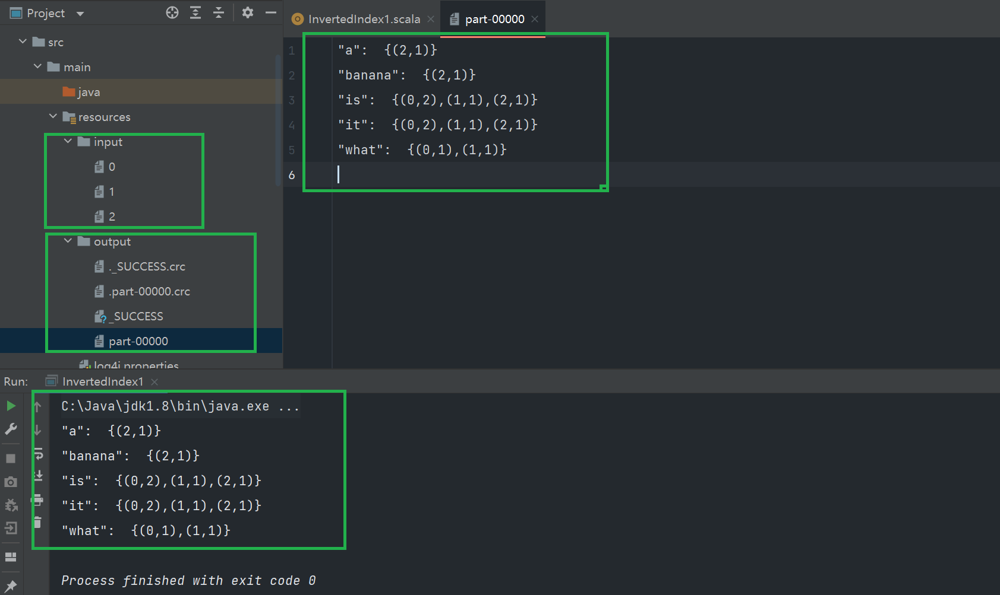

Spark作业

目录： 

[toc]

## Hive 建表

```sql
create table hive_sql_test1.t_user(
userid bigint,
sex String,
age int,
occupation String,
zipcode String
)
row format delimited fields terminated by ':';
load data local inpath '/home/hive/users.dat'  overwrite into  table  hive_sql_test1.t_user;


create table hive_sql_test1.t_movie
(
movieid bigint,
moviename string,
movietype string
)
row format delimited fields terminated by ':';
load data local inpath '/home/hive/movies.dat' overwrite into table hive_sql_test1.t_movie;


create table hive_sql_test1.t_rating
(
userid bigint,
movieid bigint,
rate double,
times  string
)
row format delimited fields terminated by ':';
load data local inpath '/home/hive/ratings.dat' overwrite into table hive_sql_test1.t_rating;
```


## 题目1 

使用RDD API实现带词频的倒排索引

倒排索引（Inverted index），也被称为反向索引。它是文档检索系统中最常用的数据结构。被广泛
地应用于全文搜索引擎。
例子如下，被索引的文件为（0，1，2代表文件名）

0. "it is what it is"
1. "what is it"
2. "it is a banana"
我们就能得到下面的反向文件索引：
"a": {2}
"banana": {2}
"is": {0, 1, 2}
"it": {0, 1, 2}
"what": {0, 1}
再加上词频为：
"a": {(2,1)}
"banana": {(2,1)}
"is": {(0,2), (1,1), (2,1)}
"it": {(0,2), (1,1), (2,1)}
"what": {(0,1), (1,1)}


#### 源码地址

https://github.com/wanghuan2054/geektime/tree/master/0815SparkAPI

#### 开发环境

1. scala 2.12.12
2. spark 3.1.2
3. hadoop 3.1.3
4. jdk 1.8.182

#### 核心思路

1. 读取指定目录下所有文本文件列表，使用wholeTextFiles方法 ，可以返回文档名和整篇文档内容的KV对

​     sc.textFile（）和sc.wholeTextFiles()都支持精确匹配文件和正则匹配文件

​     sc.textFiles(path) 能将path 里的所有文件内容读出，以文件中的每一行作为一条记录的方式。

​     wholeTextFiles允许你读取文件夹下所有的文件，比如多个小的文本文件， 返回[(k,v),(k1,v1),....]  k代表文件名 , v代表整个文件内容。

用textFile时，它的partition的数量是与文件夹下的文件数量（实例中用3个文件）相关，一个文件就是一个partition(既然3个文件就是：partition=3，特别提醒：这里的测试数据是几十byte，较小，如果每个文件较大，要根据相应切分原则切分)。
wholeTextFiles的partition数量是根据用户指定或者文件大小来（文件内的数据量少）确定，与hdfs目录下的文件数量无关！ 所以wholeTextFile通常用于读取许多小文件的需求。

2. 从文件全路径名K中， 提取出名字（正则匹配/取出文件名）
3. 将文档内容中的换行符替换成空格，考虑到windows和linux平台换行符不同 ， 及其它一些特殊的stop words替换清洗
4. 对文档内容切分并压平  , 组装 , 分组聚合 ，并按照文档ID 升序排列
5. 将结果格式化成目标输出格式，为避免小文件，采用coalesce(1)缩减分区（coalesce会比repartition减少shuffle次数），并写入最终输出目录中单个文件中。

#### POM文件

```xml
<?xml version="1.0" encoding="UTF-8"?>
<project xmlns="http://maven.apache.org/POM/4.0.0"
         xmlns:xsi="http://www.w3.org/2001/XMLSchema-instance"
         xsi:schemaLocation="http://maven.apache.org/POM/4.0.0 http://maven.apache.org/xsd/maven-4.0.0.xsd">
    <modelVersion>4.0.0</modelVersion>

    <groupId>org.example</groupId>
    <artifactId>SparkAPI</artifactId>
    <version>1.0-SNAPSHOT</version>

    <properties>
        <maven.compiler.source>8</maven.compiler.source>
        <maven.compiler.target>8</maven.compiler.target>
        <project.build.sourceEncoding>UTF-8</project.build.sourceEncoding>
        <scala.version>2.12</scala.version>
        <scala.binary.version>2.12.12</scala.binary.version>
        <spark.version>3.1.2</spark.version>
        <hadoop.version>3.2</hadoop.version>
    </properties>

    <dependencies>
        <dependency>
            <groupId>org.apache.spark</groupId>
            <artifactId>spark-core_${scala.version}</artifactId>
            <version>${spark.version}</version>
        </dependency>
    </dependencies>

    <build>
        <plugins>
        <!-- 该插件将scala代码编译成class文件 -->
        <plugin>
            <groupId>net.alchim31.maven</groupId>
            <artifactId>scala-maven-plugin</artifactId>
            <version>3.2.2</version>
            <executions>
                <execution>
                    <goals>
                        <goal>compile</goal>
                        <goal>testCompile</goal>
                    </goals>
                </execution>
            </executions>
        </plugin>
        </plugins>
    </build>

</project>
```


#### 本地运行




#### 集群运行

##### Input文件上传HDFS

```shell
[root@node1 hadoop-3.1.3]# bin/hdfs dfs -put /home/hadoop/input/* /tmp/input/

# 验证上传是否成功
[root@node1 hadoop-3.1.3]# bin/hdfs dfs -ls /tmp/input/
SLF4J: Class path contains multiple SLF4J bindings.
SLF4J: Found binding in [jar:file:/opt/software/hadoop-3.1.3/share/hadoop/common/lib/slf4j-log4j12-1.7.25.jar!/org/slf4j/impl/StaticLoggerBinder.class]
SLF4J: Found binding in [jar:file:/opt/software/hive-3.1.2/lib/log4j-slf4j-impl-2.10.0.jar!/org/slf4j/impl/StaticLoggerBinder.class]
SLF4J: See http://www.slf4j.org/codes.html#multiple_bindings for an explanation.
SLF4J: Actual binding is of type [org.slf4j.impl.Log4jLoggerFactory]
Found 4 items
-rw-r--r--   3 root supergroup         16 2021-08-18 15:57 /tmp/input/0
-rw-r--r--   3 root supergroup         10 2021-08-18 15:57 /tmp/input/1
-rw-r--r--   3 root supergroup         14 2021-08-18 15:57 /tmp/input/2
```

##### spark-submit提交jar包

```shell
#  hdfs 路径
[root@node1 hadoop-3.1.3]# bin/spark-submit --master yarn --deploy-mode client --class com.geektime.InvertedIndex1 /home/hadoop/SparkAPI-1.0-SNAPSHOT.jar hdfs:///tmp/input/ hdfs:///tmp/output/

# 本地路径
[root@node1 hadoop-3.1.3]#  bin/spark-submit --master yarn --deploy-mode client --class com.geektime.InvertedIndex1 /home/hadoop/SparkAPI-1.0-SNAPSHOT.jar file:///home/hadoop/input/ file:///home/hadoop/output/
```

##### 运行结果


## 题目2

困难：找出影评次数最多的女士所给出最高分的10部电影的平均影评分，展示电影名和平均影评分（可使用多行SQL）

### 写法1 

嵌套子查询

#### SQL

```sql
SELECT t3.moviename,
       avg(t2.rate) AS avgrate
FROM (SELECT a.movieid , a.rate
   FROM  (SELECT t.userid,
          count(*) AS total
   FROM hive_sql_test1.t_user t
   INNER JOIN hive_sql_test1.t_rating t1 ON (T.userid = T1.userid)
   WHERE t.sex = 'F'
   GROUP BY T.userid
   ORDER BY total DESC
   LIMIT 1) x
   inner join hive_sql_test1.t_rating a on (x.userid = a.userid)
   ORDER BY a.rate DESC
   LIMIT 10)  t1
INNER JOIN hive_sql_test1.t_rating t2 on(t1.movieid = t2.movieid)
INNER JOIN hive_sql_test1.t_movie t3 on(t2.movieid = t3.movieid)
GROUP BY t2.movieid , t3.moviename
ORDER BY avgrate DESC ;
```

#### 运行结果


### 写法2

WITH ..... AS .....

#### SQL

```sql
-- 找出影评次数最多的女士
WITH Rating_CNT AS
  (SELECT t.userid,
          count(*) AS total
   FROM hive_sql_test1.t_user t
   INNER JOIN hive_sql_test1.t_rating t1 ON (T.userid = T1.userid)
   WHERE t.sex = 'F'
   GROUP BY T.userid
   ORDER BY total DESC
   LIMIT 1), 
-- 找出该女士评分最高的10部电影
TOPMOVIES AS
  (SELECT a.movieid , a.rate
   FROM  Rating_CNT x
   inner join hive_sql_test1.t_rating a on (x.userid = a.userid)
   ORDER BY a.rate DESC
   LIMIT 10) 
   
-- select t2.* from TOPMOVIES t2;

-- 求这10部电影的平均影评分，展示电影名和平均影评分
SELECT t3.moviename,
       avg(t2.rate) AS avgrate
FROM TOPMOVIES  t1
INNER JOIN hive_sql_test1.t_rating t2 on(t1.movieid = t2.movieid)
INNER JOIN hive_sql_test1.t_movie t3 on(t2.movieid = t3.movieid)
GROUP BY t2.movieid , t3.moviename
ORDER BY avgrate DESC ;
```

#### 运行结果


