SparkSQL作业

目录： 

## 题目1 

为Spark SQL添加一条自定义命令

• SHOW VERSION
• 显示当前Spark版本和Java版本

#### Spark源码编译问题

##### 问题1

[ERROR] Failed to execute goal org.apache.maven.plugins:maven-surefire-plugin:3.0.0-M1:test (default-test) on project leshan-integration-tests: There are test failures.

##### 解决方法

使用插件，在相应pom.xml文件里面，修改

```xml
<build>
    <plugins>
        <plugin>
            <groupId>org.apache.maven.plugins</groupId>
            <artifactId>maven-surefire-plugin</artifactId>
            <configuration>
                <testFailureIgnore>true</testFailureIgnore>
            </configuration>
        </plugin>
    </plugins>
 </build>
```

##### 问题2 

Failed to execute goal org.apache.maven.plugins:maven-antrun-plugin:1.8:run (default) on project spark-core_2.12: An Ant BuildException has occured: Execute failed: java.io.IOException: Cannot run program "bash" : CreateProcess error=2

##### 解决办法

在spark源码目录下使用git bash执行命令

```shell
mvn clean package -DskipTests -Phive -Phive-thriftserver
```


#### Maven 编译

```shell
mvn clean package -DskipTests -Phive -Phive-thriftserver
```

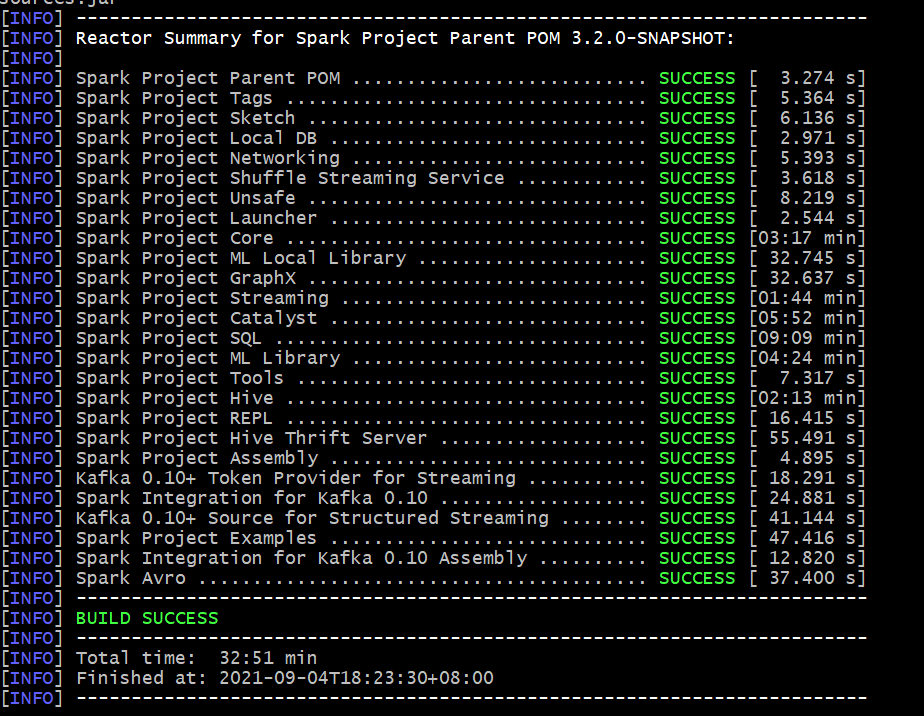

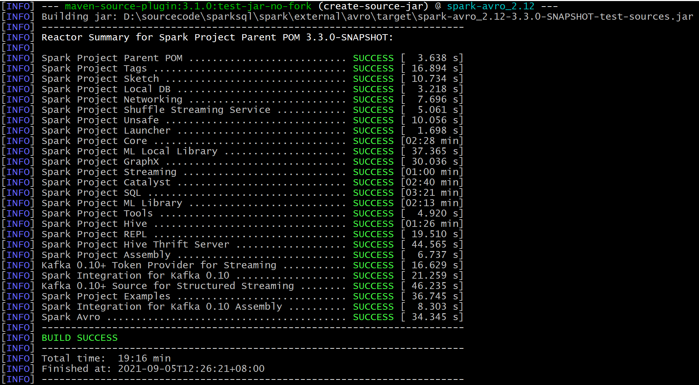

#### 结果验证

##### Spark-sql 启动

windows 下编译成功了 ，启动spark-sql 验证结果时一直报错，解决不了

```shell
$ bin/spark-sql.cmd -S
Exception in thread "main" java.lang.UnsatisfiedLinkError: org.apache.hadoop.io.nativeio.NativeIO$POSIX.stat(Ljava/lang/String;)Lorg/apache/hadoop/io/nativeio/NativeIO$POSIX$Stat;
        at org.apache.hadoop.io.nativeio.NativeIO$POSIX.stat(Native Method)
        at org.apache.hadoop.io.nativeio.NativeIO$POSIX.getStat(NativeIO.java:460)
        at org.apache.hadoop.fs.RawLocalFileSystem$DeprecatedRawLocalFileStatus.loadPermissionInfoByNativeIO(RawLocalFileSystem.java:821)
        at org.apache.hadoop.fs.RawLocalFileSystem$DeprecatedRawLocalFileStatus.loadPermissionInfo(RawLocalFileSystem.java:735)
        at org.apache.hadoop.fs.RawLocalFileSystem$DeprecatedRawLocalFileStatus.getPermission(RawLocalFileSystem.java:703)
        at org.apache.hadoop.hive.ql.session.SessionState.createRootHDFSDir(SessionState.java:711)
        at org.apache.hadoop.hive.ql.session.SessionState.createSessionDirs(SessionState.java:654)
        at org.apache.hadoop.hive.ql.session.SessionState.start(SessionState.java:586)
        at org.apache.hadoop.hive.ql.session.SessionState.start(SessionState.java:548)
        at org.apache.spark.sql.hive.thriftserver.SparkSQLCLIDriver$.main(SparkSQLCLIDriver.scala:135)
        at org.apache.spark.sql.hive.thriftserver.SparkSQLCLIDriver.main(SparkSQLCLIDriver.scala)
        at sun.reflect.NativeMethodAccessorImpl.invoke0(Native Method)
        at sun.reflect.NativeMethodAccessorImpl.invoke(NativeMethodAccessorImpl.java:62)
        at sun.reflect.DelegatingMethodAccessorImpl.invoke(DelegatingMethodAccessorImpl.java:43)
        at java.lang.reflect.Method.invoke(Method.java:498)
        at org.apache.spark.deploy.JavaMainApplication.start(SparkApplication.scala:52)
        at org.apache.spark.deploy.SparkSubmit.org$apache$spark$deploy$SparkSubmit$$runMain(SparkSubmit.scala:928)
        at org.apache.spark.deploy.SparkSubmit.doRunMain$1(SparkSubmit.scala:180)
        at org.apache.spark.deploy.SparkSubmit.submit(SparkSubmit.scala:203)
        at org.apache.spark.deploy.SparkSubmit.doSubmit(SparkSubmit.scala:90)
        at org.apache.spark.deploy.SparkSubmit$$anon$2.doSubmit(SparkSubmit.scala:1007)
        at org.apache.spark.deploy.SparkSubmit$.main(SparkSubmit.scala:1016)
        at org.apache.spark.deploy.SparkSubmit.main(SparkSubmit.scala)
```

##### Building a Runnable Distribution

build 成功后， windows下spark-sql启动不了，按照官网build spark 思路 ， 打成tgz包，发布到linux环境验证

```shell
# 打包命令帮助
./dev/make-distribution.sh --help

# Building a Runnable Distribution
./dev/make-distribution.sh --name spark-3.2  --tgz -Phive -Phive-thriftserver  -Pyarn -DskipTests  -Dmaven.compile.fork=true -T 1C clean package

# 如果需要是堆内存不够，则设置最大堆大小-Xmx，如果是持久代溢出，比如出现PermGen space异常，则设置-XX:MaxPermSize即可
 set MAVEN_OPTS= -Xms800m -Xmx800m -XX:MaxNewSize=512m  -XX:MaxPermSize=512m
export MAVEN_OPTS="-Xms6g -Xmx6g -XX:+UseG1GC -XX:ReservedCodeCacheSize=2g" 

增加跳过测试代码的编译命令： -Dmaven.test.skip=true 
指明多线程进行编译：-Dmaven.compile.fork=true
增加CPU核心参数：-T 1C
```

./dev/make-distribution.sh --name spark-3.2  --tgz -Phive -Phive-thriftserver  -Pyarn -DskipTests  -Dmaven.compile.fork=true -T 1C clean package windows下执行脚本一直报错解决不掉。

##### 上传到Linux集群

一直报错，因为windwos下是\r\n换行， linux 是\n ，这个脚本我都从dos改成unix ， 可能还是格式不对， 多了一个\r ，

把其他可以运行的spark sql 拷贝过来一个，依然报这个错

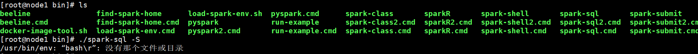

#### 自定义parser

##### POM

```xml
<project xmlns="http://maven.apache.org/POM/4.0.0" xmlns:xsi="http://www.w3.org/2001/XMLSchema-instance"
         xsi:schemaLocation="http://maven.apache.org/POM/4.0.0 http://maven.apache.org/maven-v4_0_0.xsd">
    <modelVersion>4.0.0</modelVersion>
    <groupId>org.example</groupId>
    <artifactId>CustomSparkSessionExtension</artifactId>
    <version>1.0-SNAPSHOT</version>
    <inceptionYear>2021</inceptionYear>
    <properties>
        <maven.compiler.source>8</maven.compiler.source>
        <maven.compiler.target>8</maven.compiler.target>
        <project.build.sourceEncoding>UTF-8</project.build.sourceEncoding>
        <scala.version>2.12</scala.version>
        <scala.binary.version>2.12.10</scala.binary.version>
        <spark.version>3.1.2</spark.version>
    </properties>

    <repositories>
        <repository>
            <id>maven-ali</id>
            <url>http://maven.aliyun.com/nexus/content/groups/public/</url>
        </repository>
    </repositories>

    <dependencies>
        <dependency>
            <groupId>org.apache.spark</groupId>
            <artifactId>spark-core_${scala.version}</artifactId>
            <version>${spark.version}</version>
<!--            <scope>provided</scope>-->
        </dependency>
        <dependency>
            <groupId>org.apache.spark</groupId>
            <artifactId>spark-sql_${scala.version}</artifactId>
            <version>${spark.version}</version>
<!--            <scope>provided</scope>-->
        </dependency>
        <dependency>
            <groupId>org.apache.spark</groupId>
            <artifactId>spark-catalyst_${scala.version}</artifactId>
            <version>${spark.version}</version>
<!--            <scope>provided</scope>-->
        </dependency>
        <dependency>
            <groupId>org.antlr</groupId>
            <artifactId>antlr4-runtime</artifactId>
            <version>4.9.2</version>
        </dependency>
    </dependencies>

    <build>
        <sourceDirectory>src/main/scala</sourceDirectory>
        <testSourceDirectory>src/test/scala</testSourceDirectory>
        <plugins>
            <!-- 该插件将scala代码编译成class文件 -->
            <plugin>
                <groupId>net.alchim31.maven</groupId>
                <artifactId>scala-maven-plugin</artifactId>
                <version>4.3.0</version>
                <executions>
                    <execution>
                        <goals>
                            <goal>compile</goal>
                            <goal>testCompile</goal>
                        </goals>
                    </execution>
                </executions>
            </plugin>

            <plugin>
                <groupId>org.antlr</groupId>
                <artifactId>antlr4-maven-plugin</artifactId>
                <executions>
                    <execution>
                        <goals>
                            <goal>antlr4</goal>
                        </goals>
                    </execution>
                </executions>
                <configuration>
                    <visitor>true</visitor>
                    <sourceDirectory>./src/main/scala/org/example/customparser</sourceDirectory>
<!--                    <outputDirectory>C:\Users\49921\Desktop\GeekTime\geektime\0829SparkSQL\src\main\scala\org\example\sparkparser</outputDirectory>-->
                    <treatWarningsAsErrors>true</treatWarningsAsErrors>
                </configuration>
            </plugin>

        </plugins>
    </build>
</project>
```

idea maven打包后上传到/opt/sourcecode

##### 运行命令

```shell
[root@node1 spark-3.1.2-bin-hadoop3.2]# SPARK_USER=wanghuan bin/spark-sql --jars /opt/sourcecode/CustomSparkSessionExtension-1.0-SNAPSHOT.jar --conf spark.sql.extensions=org.example.MyCustomSparkExtension
```

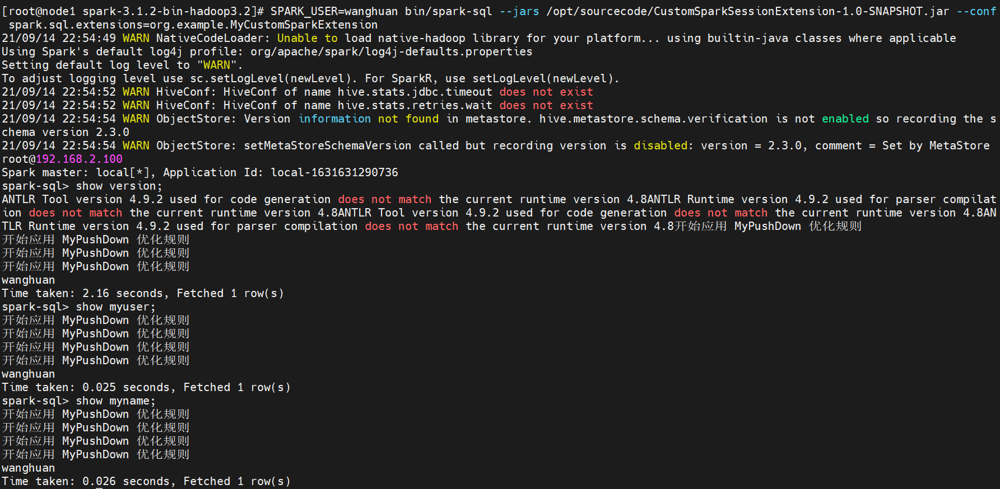

## 题目2

构建SQL满足如下要求

通过set spark.sql.planChangeLog.level=WARN;查看
1. 构建一条SQL，同时apply下面三条优化规则：
    CombineFilters
    CollapseProject
    BooleanSimplification

2. 构建一条SQL，同时apply下面五条优化规则：
    ConstantFolding
    PushDownPredicates
    ReplaceDistinctWithAggregate
    ReplaceExceptWithAntiJoin
    FoldablePropagation

  

##### 准备工作 

```sql
# 建表语句
create table tmp (id int , name String);
# 插入数据
insert into tmp values(1,'wanghuan');
insert into tmp values(1,'fanfan');
insert into tmp values(1,'doudou');
insert into tmp values(1,'tom');


set spark.sql.planChangeLog.level=WARN;
```

#### 1. 第一条SQL

```sql
select name from (
  select id+(1+2) as id, name from tmp a where id =1 and 1 = 1 
) where name='wanghuan';
```

##### planChangeLog

采用PushDownPredicates 替代了CombineFilters 规则， CombineFilters 算子没有写出对应SQL

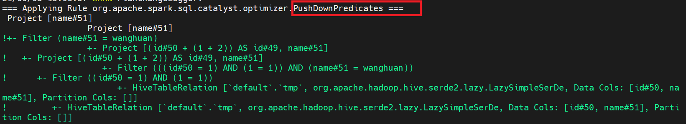

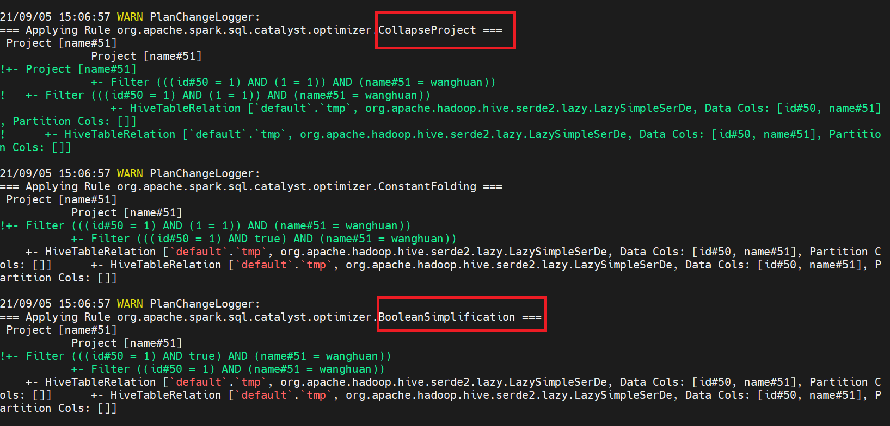


#### 2.第二条SQL

```sql
select distinct name , 'MAX' AS A from (
  select id+(1+2) as id, name from tmp a where id IN (1,2,3) and 1 = 1 
  except select id+(1+2) as id, name from tmp a where id =1   
) where name='wanghuan'
order by A desc ;
```

##### planChangeLog

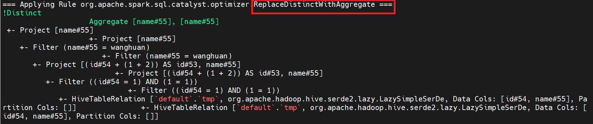

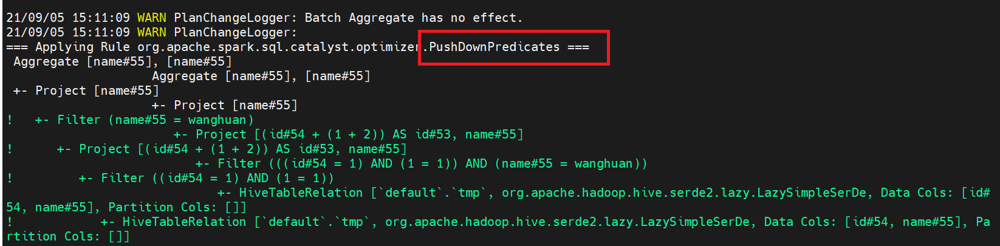

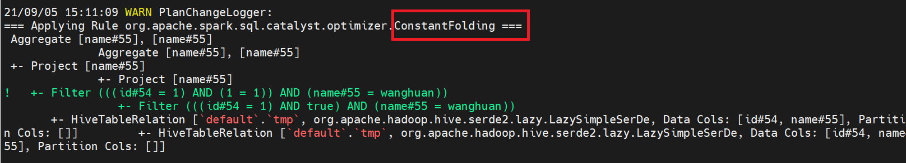

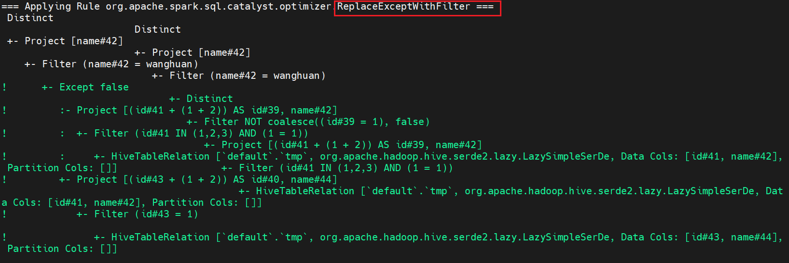

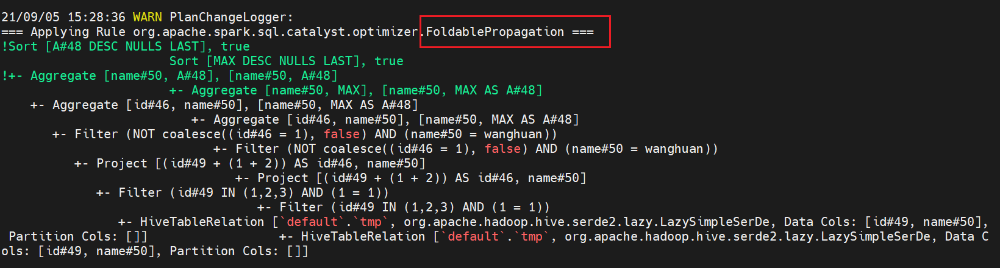


## 题目3

实现自定义优化规则（静默规则）

第一步实现自定义规则（静默规则，通过set spark.sql.planChangeLog.level=WARN;确认执行到就行）
case class MyPushDown(spark: SparkSession) extends Rule[LogicalPlan] {
def apply(plan: LogicalPlan): LogicalPlan = plan transform { …. }
}
第二步创建自己的Extension并注入
class MySparkSessionExtension extends (SparkSessionExtensions => Unit) {
override def apply(extensions: SparkSessionExtensions): Unit = {
extensions.injectOptimizerRule { session =>
new MyPushDown(session)
}
}
}
第三步通过spark.sql.extensions提交
bin/spark-sql --jars /opt/sourcecode/CustomSparkSessionExtension-1.0-SNAPSHOT.jar --conf spark.sql.extensions=org.example.MyCustomSparkExtension

#### POM

```xml
<project xmlns="http://maven.apache.org/POM/4.0.0" xmlns:xsi="http://www.w3.org/2001/XMLSchema-instance"
         xsi:schemaLocation="http://maven.apache.org/POM/4.0.0 http://maven.apache.org/maven-v4_0_0.xsd">
    <modelVersion>4.0.0</modelVersion>
    <groupId>org.example</groupId>
    <artifactId>CustomSparkSessionExtension</artifactId>
    <version>1.0-SNAPSHOT</version>
    <inceptionYear>2021</inceptionYear>
    <properties>
        <maven.compiler.source>8</maven.compiler.source>
        <maven.compiler.target>8</maven.compiler.target>
        <project.build.sourceEncoding>UTF-8</project.build.sourceEncoding>
        <scala.version>2.12</scala.version>
        <scala.binary.version>2.12.10</scala.binary.version>
        <spark.version>3.1.2</spark.version>
    </properties>

    <repositories>
        <repository>
            <id>maven-ali</id>
            <url>http://maven.aliyun.com/nexus/content/groups/public/</url>
        </repository>
    </repositories>

    <dependencies>
        <dependency>
            <groupId>org.apache.spark</groupId>
            <artifactId>spark-core_${scala.version}</artifactId>
            <version>${spark.version}</version>
            <scope>provided</scope>
        </dependency>
        <dependency>
            <groupId>org.apache.spark</groupId>
            <artifactId>spark-sql_${scala.version}</artifactId>
            <version>${spark.version}</version>
            <scope>provided</scope>
        </dependency>
        <dependency>
            <groupId>org.apache.spark</groupId>
            <artifactId>spark-catalyst_${scala.version}</artifactId>
            <version>${spark.version}</version>
            <scope>provided</scope>
        </dependency>
    </dependencies>

    <build>
        <sourceDirectory>src/main/scala</sourceDirectory>
        <testSourceDirectory>src/test/scala</testSourceDirectory>
        <plugins>
            <!-- 该插件将scala代码编译成class文件 -->
            <plugin>
                <groupId>net.alchim31.maven</groupId>
                <artifactId>scala-maven-plugin</artifactId>
                <version>4.3.0</version>
                <executions>
                    <execution>
                        <goals>
                            <goal>compile</goal>
                            <goal>testCompile</goal>
                        </goals>
                    </execution>
                </executions>
            </plugin>
        </plugins>
    </build>
</project>
```

#### MyPushDown

实现自定义规则

```scala
package org.example

import org.apache.spark.sql.SparkSession
import org.apache.spark.sql.catalyst.plans.logical.LogicalPlan
import org.apache.spark.sql.catalyst.rules.Rule
import org.apache.spark.sql.catalyst.expressions.{Literal, Multiply}
import org.apache.spark.sql.types.Decimal

case class MyPushDown(spark: SparkSession) extends Rule[LogicalPlan] {
  override def apply(plan: LogicalPlan): LogicalPlan = {
    println("开始应用 MyPushDown 优化规则")
    plan transformAllExpressions {
      case Multiply(left, right,true) if right.isInstanceOf[Literal] &&
        right.asInstanceOf[Literal].value.isInstanceOf[Decimal] &&
        right.asInstanceOf[Literal].value.asInstanceOf[Decimal].toDouble == 1.0 =>
        println("MyPushDown 优化规则生效")
        left
    }
  }
}
```


#### MyCustomSparkExtension

创建自己的Extension并注入

```scala
package org.example

import org.apache.spark.sql.SparkSessionExtensions
import org.apache.spark.sql.catalyst.plans.logical.LogicalPlan
import org.apache.spark.sql.catalyst.rules.Rule
import org.apache.spark.sql.SparkSession

class MyCustomSparkExtension extends (SparkSessionExtensions => Unit) {
  override def apply(extensions: SparkSessionExtensions): Unit = {
    extensions.injectOptimizerRule { session =>
      new MyPushDown(session)
    }
  }
}
```

#### spark.sql.extensions提交

```shell
bin/spark-sql --jars /opt/sourcecode/CustomSparkSessionExtension-1.0-SNAPSHOT.jar --conf spark.sql.extensions=org.example.MyCustomSparkExtension

方法1 ：
spark-sql> explain extended select id * 1.0 from tmp ;

方法2 ：
spark-sql> set spark.sql.planChangeLog.level=WARN;
spark-sql> explain extended select id * 1.0 from tmp ;
```

#### 验证结果 

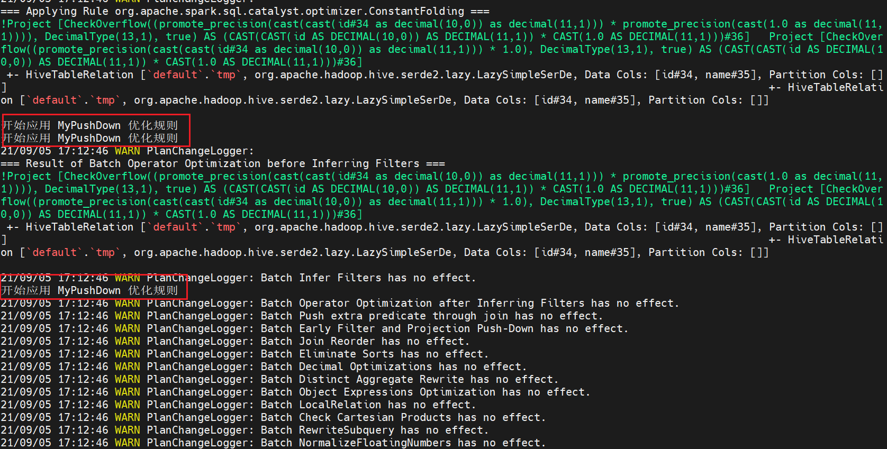
