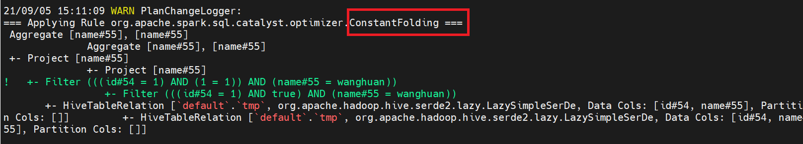

SparkSQL优化作业

目录： 

## 题目1 

如何避免小文件问题 

其实没有完美的解决办法，最终思路还是于小文件大小个数和写入速度上的一个trade off

### 思路1 ： 减少reduce个数

在不影响作业运行的并行度情况下，尽量去减少reduce个数。

1. spark中repartition和coalesce就是通过减少分区数来避免过多小文件输出。
2. spark AQE根据shuffle write数据量动态调整reduce个数，设置参数后，自动合并后的文件大小平均，且不需要额外的任务做小文件合并，性能和耗时都有明显提升。
3. 手动设定map端、reduce端个数

### 思路2 ： 小文件合并

对小文件输出的时候进行合并 ,包括写入时处理和写入后处理

1. 设置map端、reduce端输出进行合并，设置合并文件的大小，当输出文件的平均大小小于该值时，启动一个独立的任务进行文件merge。
2. 小文件生成之后，单独启动任务进行归档合并，如hadoop archive，生成一个HAR文件去存储。或者编写手动合并小文件程序，去把已存在分区、分桶内的所有小文件combine到一个文件中。
3. 在写入时不会每次都生成一个小文件，而是通过找出低于设定阈值的现有小文件进行追加写来规避小文件。需要维护一套索引机制，具备可以动态分配记录到不同文件的能力。
4. 输出后小文件进行同步或已补聚簇，如hudi Clustering使得大数据进行流处理，摄取可以写入小文件以满足流处理的延迟要求，也可以在后台使用Clustering将这些小文件重写成较大的文件并减少文件数。


## 题目2

构建SQL满足如下要求

通过set spark.sql.planChangeLog.level=WARN;查看
1. 构建一条SQL，同时apply下面三条优化规则：
    CombineFilters
    CollapseProject
    BooleanSimplification

2. 构建一条SQL，同时apply下面五条优化规则：
    ConstantFolding
    PushDownPredicates
    ReplaceDistinctWithAggregate
    ReplaceExceptWithAntiJoin
    FoldablePropagation

  

##### 准备工作 

```sql
# 建表语句
create table tmp (id int , name String);
# 插入数据
insert into tmp values(1,'wanghuan');
insert into tmp values(1,'fanfan');
insert into tmp values(1,'doudou');
insert into tmp values(1,'tom');


set spark.sql.planChangeLog.level=WARN;
```

#### 1. 第一条SQL

```sql
select name from (
  select id+(1+2) as id, name from tmp a where id =1 and 1 = 1 
) where name='wanghuan';
```

##### planChangeLog

采用PushDownPredicates 替代了CombineFilters 规则， CombineFilters 算子没有写出对应SQL


#### 2.第二条SQL

```sql
select distinct name , 'MAX' AS A from (
  select id+(1+2) as id, name from tmp a where id IN (1,2,3) and 1 = 1 
  except select id+(1+2) as id, name from tmp a where id =1   
) where name='wanghuan'
order by A desc ;
```

##### planChangeLog





## 题目3

实现自定义优化规则（静默规则）

第一步实现自定义规则（静默规则，通过set spark.sql.planChangeLog.level=WARN;确认执行到就行）
case class MyPushDown(spark: SparkSession) extends Rule[LogicalPlan] {
def apply(plan: LogicalPlan): LogicalPlan = plan transform { …. }
}
第二步创建自己的Extension并注入
class MySparkSessionExtension extends (SparkSessionExtensions => Unit) {
override def apply(extensions: SparkSessionExtensions): Unit = {
extensions.injectOptimizerRule { session =>
new MyPushDown(session)
}
}
}
第三步通过spark.sql.extensions提交
bin/spark-sql --jars /opt/sourcecode/CustomSparkSessionExtension-1.0-SNAPSHOT.jar --conf spark.sql.extensions=org.example.MyCustomSparkExtension

#### POM

```xml
<project xmlns="http://maven.apache.org/POM/4.0.0" xmlns:xsi="http://www.w3.org/2001/XMLSchema-instance"
         xsi:schemaLocation="http://maven.apache.org/POM/4.0.0 http://maven.apache.org/maven-v4_0_0.xsd">
    <modelVersion>4.0.0</modelVersion>
    <groupId>org.example</groupId>
    <artifactId>CustomSparkSessionExtension</artifactId>
    <version>1.0-SNAPSHOT</version>
    <inceptionYear>2021</inceptionYear>
    <properties>
        <maven.compiler.source>8</maven.compiler.source>
        <maven.compiler.target>8</maven.compiler.target>
        <project.build.sourceEncoding>UTF-8</project.build.sourceEncoding>
        <scala.version>2.12</scala.version>
        <scala.binary.version>2.12.10</scala.binary.version>
        <spark.version>3.1.2</spark.version>
    </properties>

    <repositories>
        <repository>
            <id>maven-ali</id>
            <url>http://maven.aliyun.com/nexus/content/groups/public/</url>
        </repository>
    </repositories>

    <dependencies>
        <dependency>
            <groupId>org.apache.spark</groupId>
            <artifactId>spark-core_${scala.version}</artifactId>
            <version>${spark.version}</version>
            <scope>provided</scope>
        </dependency>
        <dependency>
            <groupId>org.apache.spark</groupId>
            <artifactId>spark-sql_${scala.version}</artifactId>
            <version>${spark.version}</version>
            <scope>provided</scope>
        </dependency>
        <dependency>
            <groupId>org.apache.spark</groupId>
            <artifactId>spark-catalyst_${scala.version}</artifactId>
            <version>${spark.version}</version>
            <scope>provided</scope>
        </dependency>
    </dependencies>

    <build>
        <sourceDirectory>src/main/scala</sourceDirectory>
        <testSourceDirectory>src/test/scala</testSourceDirectory>
        <plugins>
            <!-- 该插件将scala代码编译成class文件 -->
            <plugin>
                <groupId>net.alchim31.maven</groupId>
                <artifactId>scala-maven-plugin</artifactId>
                <version>4.3.0</version>
                <executions>
                    <execution>
                        <goals>
                            <goal>compile</goal>
                            <goal>testCompile</goal>
                        </goals>
                    </execution>
                </executions>
            </plugin>
        </plugins>
    </build>
</project>
```

#### MyPushDown

实现自定义规则

```scala
package org.example

import org.apache.spark.sql.SparkSession
import org.apache.spark.sql.catalyst.plans.logical.LogicalPlan
import org.apache.spark.sql.catalyst.rules.Rule
import org.apache.spark.sql.catalyst.expressions.{Literal, Multiply}
import org.apache.spark.sql.types.Decimal

case class MyPushDown(spark: SparkSession) extends Rule[LogicalPlan] {
  override def apply(plan: LogicalPlan): LogicalPlan = {
    println("开始应用 MyPushDown 优化规则")
    plan transformAllExpressions {
      case Multiply(left, right,true) if right.isInstanceOf[Literal] &&
        right.asInstanceOf[Literal].value.isInstanceOf[Decimal] &&
        right.asInstanceOf[Literal].value.asInstanceOf[Decimal].toDouble == 1.0 =>
        println("MyPushDown 优化规则生效")
        left
    }
  }
}
```


#### MyCustomSparkExtension

创建自己的Extension并注入

```scala
package org.example

import org.apache.spark.sql.SparkSessionExtensions
import org.apache.spark.sql.catalyst.plans.logical.LogicalPlan
import org.apache.spark.sql.catalyst.rules.Rule
import org.apache.spark.sql.SparkSession

class MyCustomSparkExtension extends (SparkSessionExtensions => Unit) {
  override def apply(extensions: SparkSessionExtensions): Unit = {
    extensions.injectOptimizerRule { session =>
      new MyPushDown(session)
    }
  }
}
```

#### spark.sql.extensions提交

```shell
bin/spark-sql --jars /opt/sourcecode/CustomSparkSessionExtension-1.0-SNAPSHOT.jar --conf spark.sql.extensions=org.example.MyCustomSparkExtension

方法1 ：
spark-sql> explain extended select id * 1.0 from tmp ;

方法2 ：
spark-sql> set spark.sql.planChangeLog.level=WARN;
spark-sql> explain extended select id * 1.0 from tmp ;
```

#### 验证结果 


