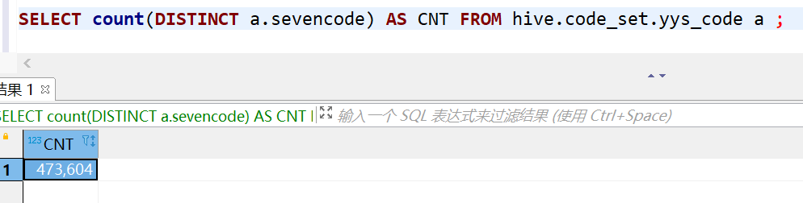
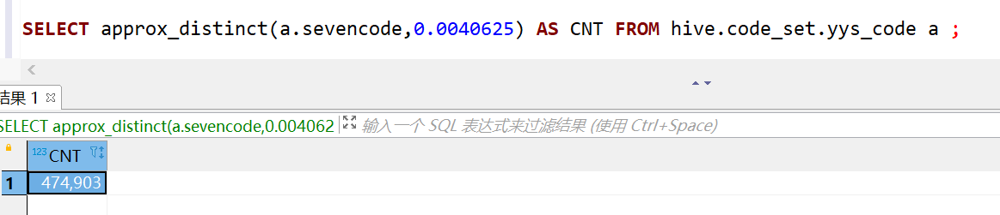
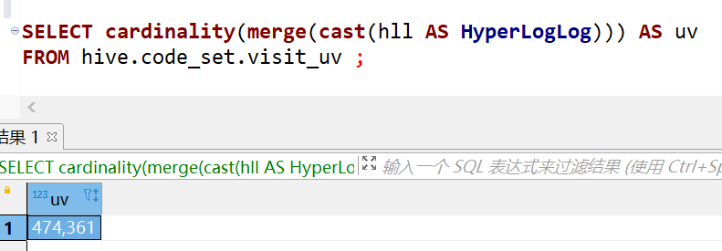
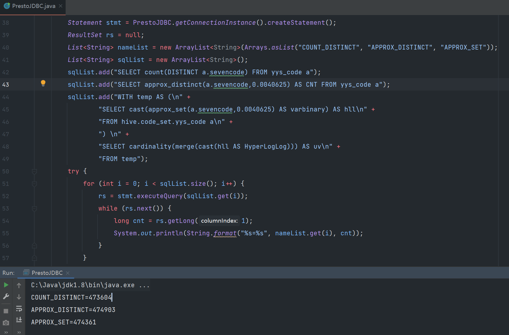

# Presto作业：近似计算在Presto的使用

## 题目1 

 搜索HyperLogLog算法相关内容，了解其原理，写出5条 HyperLogLog的用途或大数据场景下的实际案例。

1. 统计注册 IP 数 |  统计每日访问 IP 数
2. 统计页面 UV 数 |  统计在线用户数
3. 统计用户每天搜索不同词条的个数
4. 数据治理过程中，数据探查或者字段探查功能中，查看某字段的cardinality预估
5. oracle或者sparl sql中CBO统计时，可以使用HLL来做histogram（直方图可以用来查看值的分布情况和倾斜程度）
6. Redis 使用HyperLogLog 算法来做**基数统计**

## 题目2

在本地docker环境或阿里云e-mapreduce环境进行SQL查询， 要求在Presto中使用HyperLogLog计算近似基数。（请自行创 建表并插入若干数据）

### 创建Hive表

```sql
DROP TABLE hive.code_set.yys_code;

CREATE TABLE hive.code_set.yys_code (
	threecode varchar,
	sevencode varchar,
	city varchar,
	areacode varchar,
	yys varchar,
	xzqhdm varchar
);

hive (code_set)> CREATE TABLE yys_code(threecode STRING,
               > sevencode STRING,
               > city STRING,
               > areacode STRING,
               > yys STRING,
               > xzqhdm STRING)
               > ROW format delimited fields terminated BY ','
               > stored AS TEXTFILE tblproperties("skip.header.line.count" = "1");
OK
Time taken: 0.046 seconds
```

### 导入数据

```shell
load data LOCAL inpath '/home/wanghuan/code_set/code_0536.csv' into table yys_code;

hive (code_set)> load data LOCAL inpath '/home/wanghuan/code_set/code_0536.csv' into table yys_code;
Loading data to table code_set.yys_code
OK
Time taken: 0.357 seconds
```

### 数据格式

联通运营商手机号段代码表 sevencode 是**主键**

| threecode | sevencode | city       | areacode | yys  | xzqhdm |
| :-------: | --------- | ---------- | -------- | ---- | ------ |
|    130    | 1300000   | 山东省济南 | 531      | 联通 | 370100 |
|    130    | 1300001   | 江苏省常州 | 519      | 联通 | 320400 |
|    130    | 1300002   | 安徽省合肥 | 551      | 联通 | 340100 |

### 实验步骤

**presto cli 工具使用dbeaver** 

**presto  版本 0.253.1**

#### count distinct    

统计全表记录数大致耗时**745ms**

```sql
SELECT count(DISTINCT a.sevencode) FROM yys_code a ;
```



#### approx_distinct

统计全表记录数大致耗时**341ms**

```sql
# 设定一个最小误差
SELECT approx_distinct(a.sevencode,0.0040625) AS CNT FROM hive.code_set.yys_code a ;
```



#### approx_set

统计全表记录数大致耗时**100ms**

1. 建表

   对于要计算uv的字段sevencode，用presto的函数计算出预估基数值，建立一张中间表来存储这个预估值

   ```sql
   DROP TABLE hive.code_set.visit_uv;
   
   CREATE TABLE hive.code_set.visit_uv (
     hll varbinary
   );
   ```

2. 插入数据

   将yys_code表的数据插入新建的中间表，其中需要求uv的字段sevencode用函数approx_set计算

   ```sql
   INSERT INTO hive.code_set.visit_uv
   SELECT cast(approx_set(a.sevencode,0.0040625) AS varbinary)
   FROM hive.code_set.yys_code a ;
   ```

3. 查询近似基数

   将预估基数值解析出来，得到uv

   ```sql
   SELECT cardinality(merge(cast(hll AS HyperLogLog))) AS uv
   FROM hive.code_set.visit_uv ;
   ```

   

### 结果统计

**presto 223 之后就支持了精确值的参数设定 ，presto的精确度的设定，范围是`[0.0040625, 0.26000]`，如果想要精确些，就填最小值。**

绝对误差=预估值与真实值差值 ， 相对误差是绝对误差与预估值或预估测量的平均值的比值，与标准误差不是一个概念，标准误差计算公式本次试验没有统计

|                       | count distinct | approx_distinct | approx_set     |
| --------------------- | -------------- | --------------- | -------------- |
| 记录数                | 473604（精确） | 474903（预估）  | 474361（预估） |
| 最大标准误差          | 0              | 0.0040625       | 0.0040625      |
| 平均运行5次耗时（ms） | 745            | 341             | 100            |
| 相对误差（%）         | 0              | 0.0027352       | 0.0015940      |

## 题目3

使用Presto-Jdbc进行SQL查询，实现HLL近似基数计算

### 代码


```java
package com.geek.sql;

import java.io.IOException;
import java.sql.*;
import java.util.ArrayList;
import java.util.Arrays;
import java.util.List;
import java.util.Properties;
import java.util.logging.LogManager;

public class PrestoJDBC {
    //获取数据库用户名
    private static String user = "root";
    //获取数据库密码
    private static String password;
    //获取数据库URL
    private static String jdbcUrl = "jdbc:presto://192.168.2.7:8081/hive/code_set";
    //获取连接对象
    private static Connection conn = null;

    //私有化构造函数，确保不被外部实例化
    private PrestoJDBC() {
    }

    //单例模式获取数据库连接
    public static Connection getConnectionInstance() throws IOException, ClassNotFoundException, SQLException {
        if (conn == null) {
            synchronized (PrestoJDBC.class) {
                if (conn == null) {
                    conn = DriverManager.getConnection(jdbcUrl, user, password);
                }
            }
        }
        return conn;
    }

    public static void main(String[] args) throws SQLException, IOException, ClassNotFoundException {
        Statement stmt = PrestoJDBC.getConnectionInstance().createStatement();
        ResultSet rs = null;
        List<String> nameList = new ArrayList<String>(Arrays.asList("COUNT_DISTINCT", "APPROX_DISTINCT", "APPROX_SET"));
        List<String> sqlList = new ArrayList<String>();
        sqlList.add("SELECT count(DISTINCT a.sevencode) FROM yys_code a");
        sqlList.add("SELECT approx_distinct(a.sevencode,0.0040625) AS CNT FROM yys_code a");
        sqlList.add("WITH temp AS (\n" +
                "SELECT cast(approx_set(a.sevencode,0.0040625) AS varbinary) AS hll\n" +
                "FROM hive.code_set.yys_code a\n" +
                ") \n" +
                "SELECT cardinality(merge(cast(hll AS HyperLogLog))) AS uv\n" +
                "FROM temp");
        try {
            for (int i = 0; i < sqlList.size(); i++) {
                rs = stmt.executeQuery(sqlList.get(i));
                while (rs.next()) {
                    long cnt = rs.getLong(1);
                    System.out.println(String.format("%s=%s", nameList.get(i), cnt));
                }
            }
        } finally {
            free(rs, stmt, conn);
        }
    }


    public static void free(ResultSet rs, Statement ps, Connection conn) {
        try {
            if (rs != null)
                rs.close();
        } catch (SQLException e) {
            System.err.println(e.getMessage());
        } finally {
            try {
                if (ps != null)
                    ps.close();
            } catch (SQLException e) {
                System.err.println(e.getMessage());
            } finally {
                if (conn != null) {
                    try {
                        conn.close();
                    } catch (Exception e) {
                        System.err.println(e.getMessage());
                    }
                }
            }
        }
    }
}
```




